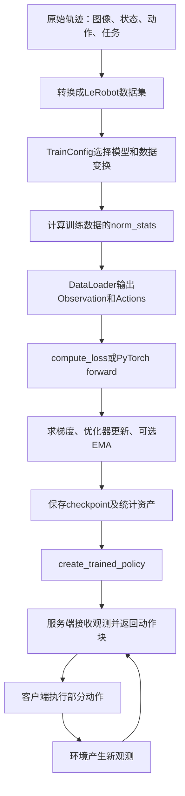

# 从数据、训练到部署：每一步做什么

<!-- reading-nav-start -->
[首页](../README.md) · [代码学习入口](README.md) · [按问题查找](../related_work/FIND_BY_QUESTION.md)
<!-- reading-nav-end -->

以LIBERO为阅读例子。下面是调用关系，不代表已经在当前电脑完成模型训练。

## 1. 轨迹转换不是训练

[convert_libero_data_to_lerobot.py](code/examples/libero/convert_libero_data_to_lerobot.py)定义字段、逐帧写入并保存episode。要关注同一帧的图像、state、action是否时间对齐，任务语言是否对应。

动作本身是什么单位、绝对值还是增量，由数据和平台决定；文件能正常读取不代表物理意义正确。

## 2. 配置把零散组件连起来

在[config.py](code/src/openpi/training/config.py)定位`pi0_libero`与`pi05_libero`。一次配置至少说明：模型结构、数据ID、输入/输出变换、预训练权重来源、学习率、batch、步数和checkpoint目录。

先读某一个具体配置，再往上追类型定义；不用先读完近千行注册表。

## 3. 归一化统计为什么要单独算

[compute_norm_stats.py](code/scripts/compute_norm_stats.py)读取经过相关前置变换的数据，累计state/action统计。训练时归一化，推理后再反归一化；两端必须用同一套约定。

如果错误地用另一种动作表示的统计，网络返回的数值即使shape正确，也会变成错误物理动作。

## 4. DataLoader到底返回什么

[data_loader.py](code/src/openpi/training/data_loader.py)串联：数据集→repack键映射→平台适配→Normalize→模型变换→组batch→Observation与Actions。

`action_horizon`让加载器读取未来动作序列，不是只取当前帧的一步动作。训练时存在真实actions；推理时真实未来动作未知，要由模型生成。

JAX训练也可能使用PyTorch DataLoader。读数据的工具与做神经网络计算的框架不必相同。

## 5. 一次训练更新

[train.py](code/scripts/train.py)的`train_step`值得精读：

1. 从结构与参数恢复可调用模型，切到训练模式。
2. 取Observation和示范Actions，调用`compute_loss`并平均。
3. 只对可训练参数求梯度。
4. 优化器读取梯度、学习率与自己的历史状态，算更新量。
5. 更新模型参数；若配置启用EMA，再维护一份平滑参数。
6. 返回新TrainState与loss/梯度范数等指标。

`loss下降`只说明当前训练目标拟合改善。机器人是否能完成任务，还要在独立环境和任务评测中验证。

## 6. checkpoint保存什么

[checkpoints.py](code/src/openpi/training/checkpoints.py)管理训练状态与资产。推理加载模型参数和统计即可；断点续训还需要训练步、优化器等信息。磁盘checkpoint与gradient checkpointing不是同一个概念。

## 7. 服务端与客户端各做什么

[serve_policy.py](code/scripts/serve_policy.py)读配置并创建Policy，然后启动[WebSocket服务](code/src/openpi/serving/websocket_policy_server.py)。服务端输入观测，输出动作块。

[客户端](code/packages/openpi-client/src/openpi_client/websocket_client_policy.py)负责传输观测/动作；[LIBERO评测循环](code/examples/libero/main.py)或真机runtime负责实际执行。服务端不会因为返回动作就自动完成一个任务。

## 8. 从阅读走向运行的顺序

先用虚拟样本检查字段与shape → 在适合的GPU环境加载checkpoint做无机器人推理 → 跑仿真评测 → 适配自己的数据并小规模微调 → 再考虑具体硬件。

当前学习交付只验证源码注释不改变可执行语义，没有执行上述模型/机器人实验。[simple_client](code/examples/simple_client/README.md)适合将来检查接口，但它的随机输入结果不代表任务成功率。

<!-- reading-footer-start -->
[接着读：π0.5差异](04_PI05_DIFF.md) · [返回代码学习入口](README.md)
<!-- reading-footer-end -->
