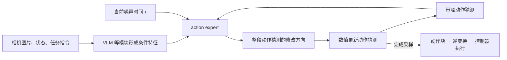

# 从零理解：action expert 的 flow matching 在学什么？

<!-- reading-nav-start -->
[首页](../README.md) · [机制入口](../related_work/MECHANISMS.md) · [按问题查找](../related_work/FIND_BY_QUESTION.md)
<!-- reading-nav-end -->

<!-- reading-toc-start -->
<details>
<summary>本页目录：按问题跳读</summary>

- [1. VLM 和 action expert 分别做什么](#1-vlm-和-action-expert-分别做什么)
- [2. 先认识 action chunk：一整段未来动作](#2-先认识-action-chunk一整段未来动作)
- [3. 一条真实训练样本到底需要什么](#3-一条真实训练样本到底需要什么)
- [4. Flow matching 的五步训练](#4-flow-matching-的五步训练)
- [5. 用两个数字手算一次](#5-用两个数字手算一次)
- [6. 推理：没有答案 A，如何生成动作？](#6-推理没有答案-a如何生成动作)
- [7. 为什么不直接回归一个动作答案？](#7-为什么不直接回归一个动作答案)
- [8. 从采集到训练，最容易出错的地方](#8-从采集到训练最容易出错的地方)
- [9. 回到注释代码：只看这四处](#9-回到注释代码只看这四处)
- [10. 自测与答案](#10-自测与答案)

</details>
<!-- reading-toc-end -->


核对日期：2026-09-19。适合已经知道“图像 + 语言 → 机器人动作”，但还不理解动作如何生成的读者。全文用本仓库固定版本 **openpi 的时间方向**，对应 π0 / π0.5 的连续动作实现。

**核心大纲：** action expert 是什么 → 一条训练数据长什么样 → 加噪声与算 loss → 推理如何得到动作 → 对应代码 → 区分世界模型。

**先记住：** action expert 是负责生成动作的神经网络模块；flow matching 是训练它的一种方法。训练时让它学会“在当前观察和指令下，应怎样修改这份带噪的动作猜测”；推理时重复修改，得到可执行的动作块。

## 1. VLM 和 action expert 分别做什么



VLM 帮助模型理解“哪里有杯子、指令要求什么”；action expert 使用这些特征、带噪动作和噪声时间，输出与动作块同形状的数字。它不是外部的人类专家，也不是自然语言计划清单。

π0 / π0.5 的具体状态入口有差异：π0 可在动作专家侧加入连续 state；π0.5 默认把离散化 state 放入语言前缀。不要把这张概念图理解为两者每个字段的接线完全一致。[代码对照](04_PI05_DIFF.md)。

## 2. 先认识 action chunk：一整段未来动作

假设一个教学机器人每次指令含 2 个数，模型一次预测 3 步：

| 将来哪个控制时刻 | 动作坐标 1 | 动作坐标 2 |
|---|---:|---:|
| 第 1 步 | 0.20 | 0.60 |
| 第 2 步 | 0.25 | 0.55 |
| 第 3 步 | 0.30 | 0.50 |

这张 `3 × 2` 的表就是动作块 $A$。实际机器人可能包含多个关节目标和夹爪命令，也可能使用末端执行器位姿增量；**含义由数据集和控制器决定**，不是所有动作都叫“关节速度”。

常见代码形状为 `[B,H,D]`：B 条样本，每条有 H 个未来控制时刻，每时刻 D 个坐标。openpi 默认统一动作维度 32、预测长度 50，并不表示每台机器人都有 32 个关节。[Pi0Config](code/src/openpi/models/pi0_config.py)。

flow matching 中一次“改动作猜测”，会同时修改这张表里的许多数。它没有按“先生成第 1 个关节，再生成第 2 个关节”的顺序逐个写答案。

## 3. 一条真实训练样本到底需要什么

以“把杯子放进柜子”为例。取真实轨迹时刻 $k$，构造：

| 字段 | 一个样本中的内容 | 从哪里来 | 作用 |
|---|---|---|---|
| 相机图像 | 当前正面/腕部等同步图片 | 相机记录 | 看环境和物体 |
| 本体状态 `state` | 当前关节位置、夹爪状态等 | 编码器/机器人日志 | 知道机器人现在的姿态 |
| 指令 `prompt` | “把杯子放进柜子”或当前子任务 | 任务配置/语言标注 | 区分这次要做什么 |
| 目标动作 `actions` | 从 k 开始的 H 个控制命令 | 遥操作、已有策略、纠错等动作日志 | 这是网络要学习生成的目标 A |
| 时间与 episode ID | 所属回合、时间戳、有效长度 | 采集系统 | 保证动作和观察对齐、不跨回合拼接 |

**`state` 是“实际在哪里”，`action` 是“要求执行什么”。** 某些控制方式下二者形式相似，但执行有延迟和误差，不能不核对定义就把下一帧实际关节角当成当前发出的动作命令。

同一条长轨迹可以在不同 k 截取许多样本。训练要提供未来动作作为答案；部署时没有这份答案，网络必须自己生成。

### 不需要人工另外采集什么

- 不需要“带噪声的机器人动作录像”：噪声由电脑随机生成。
- 不需要人工标“每一步去噪方向”：知道 A 和噪声，就能算出训练目标。
- 基础监督式 flow matching 不要求奖励、成功率分数或价值模型。RECAP 为了比较行为质量，才另加相应数据与学习过程。
- 不要求一条数据包含“机器人从随机姿势纠正到标准姿势”的物理过程。生成时的噪声轨迹发生在数字空间，不能发给机器人逐步执行。

只有普通视频而没有对应动作，通常不能直接构造这里的机器人动作损失。视频仍可用于视觉语言共训，或经动作重建/标注等额外步骤使用；那是另一层数据处理。

## 4. Flow matching 的五步训练

下面只解释连续动作头的 loss，不把整个 VLA 的图文、离散动作等联合目标都混进来。依据 [π0 方法部分](../related_work/papers/pi/pi0.pdf) 和 [openpi `compute_loss`](code/src/openpi/models/pi0.py#L228)。

### 第一步：拿到正确动作 A 和条件 c

$A$ 是日志里的目标动作块，通常已经按对应数据配置完成坐标变换、归一化和 padding。$c$ 表示当前图像、指令、state 等可用条件。

归一化是把不同数值尺度整理到更适合学习的范围；输出后还要按同一套统计和约定还原。训练采用增量、推理却当成绝对位置，算出的数字再准确也会执行错。

### 第二步：随机抽一份同形状的噪声 ε 和一个时间 τ

$\epsilon$ 是与 A 同形状的高斯随机数。$\tau$ 是 0 到 1 之间的数，表示这份动作猜测有多少噪声。

**τ 不是机器人执行了几秒。** 本文约定：τ=0 是干净动作，τ=1 是纯噪声。openpi 训练具体使用经过缩放的 Beta(1.5,1) 分布来抽 τ；概念上先理解“每次随机抽一个噪声程度”即可。

### 第三步：把正确动作和噪声混合

$$
x_\tau=(1-\tau)A+\tau\epsilon.
$$

| τ | 这份猜测长什么样 |
|---:|---|
| 0 | 完全是日志动作 A |
| 0.25 | 75% A + 25% 噪声 |
| 0.5 | 一半 A、一半噪声 |
| 1 | 完全是噪声 ε |

训练人为构造了这条简单路径，因而知道它沿 τ 增大时的变化率：

$$
u=\frac{dx_\tau}{d\tau}=\epsilon-A.
$$

这里的“速度/向量场”是**动作猜测对噪声时间的变化率**，不是机器人关节在真实世界中的角速度。

### 第四步：让网络预测这个变化率

$$
v_\theta(x_\tau,\tau,c)\approx u.
$$

网络看见带噪动作、τ 和观察条件，但不会额外拿到干净答案 A。训练程序知道 A，可以生成监督；这和老师拿着答案批改学生作业类似。

目标 u 通过 A 和 ε 自动算出，所以不需要人工逐帧标注流场。

### 第五步：比较误差并更新网络参数

$$
\mathcal L_{\mathrm{action}}=
\mathbb E_{(c,A),\epsilon,\tau}
\left[\left\|v_\theta(x_\tau,\tau,c)-(\epsilon-A)\right\|^2\right].
$$

平方误差越小，说明预测的修改方向越接近训练目标。训练程序反向传播，微调网络参数 θ；反复换样本、噪声和 τ，学习各种情况下的修改规则。

一次训练通常只抽一个 τ 来计算这条样本的损失，**不需要每条样本先把整个去噪过程从头跑完**。代码在动作坐标轴上平均，训练循环再作整体归约；上式省略这些平均因子。

## 5. 用两个数字手算一次

以下只取动作表中的一行，数值已归一化，用来理解计算：

```text
正确动作 A       = [ 0.2,  0.6]
随机噪声 ε       = [ 1.0, -1.0]
噪声时间 τ       = 0.5
带噪动作 x       = 0.5*A + 0.5*ε = [0.6, -0.2]
正确变化率 u     = ε-A = [0.8, -1.6]
假设网络预测 v   = [0.7, -1.4]
均方误差        = ((0.7-0.8)^2 + (-1.4+1.6)^2)/2 = 0.025
```

现在如果网络恰好预测出正确 u，并让 τ 从 0.5 降到 0.25，步长就是 `-0.25`：

```text
新的动作猜测 = [0.6, -0.2] + (-0.25)*[0.8, -1.6]
            = [0.4,  0.2]
```

它更接近正确动作 `[0.2,0.6]`。**这只是已知一对 A、ε 时的教学算例。** 实际推理不知道 A，只能使用训练好的网络；不能把 `ε-A` 写进推理程序充当模型输出。

## 6. 推理：没有答案 A，如何生成动作？

1. 读取当前图像、state 和指令，形成条件 c。
2. 随机产生初始动作猜测 `x = ε`，设 τ=1。
3. 网络预测 `v = expert(x, τ, c)`。
4. 用负步长更新 `x = x + Δτ*v`，同时降低 τ。
5. 重复直到 τ≈0，得到完整动作块；还原动作表示后，由控制器执行其中一段。
6. 获得新观察后，再预测下一块，形成闭环。

这一轮采样中，网络参数 θ 不更新；更新的是**正在生成的动作数组 x**。训练更新 θ、采样更新 x、机器人执行更新真实状态，这三件事要分开。

| 容易混淆的“步” | 指什么 | 例如 |
|---|---|---|
| 训练步 | 用一批数据更新一次参数 | train_step |
| flow 积分步 | 修改一次整段动作猜测 | 默认 sample_actions 做 10 步 |
| 动作块长度 | 一次输出覆盖多少控制时刻 | action_horizon=50 |
| 真机控制周期 | 控制器多久应用一次命令 | 50 Hz 时每 20 ms 一次 |

10 次积分不等于只输出 10 个动作。若采用 50 Hz，50 个控制周期约覆盖 1 秒；不同平台有不同控制频率，客户端也可以只执行动作块的一部分。参考 [`sample_actions`](code/src/openpi/models/pi0.py#L266) 与 [训练/部署流程](05_TRAINING_AND_DEPLOYMENT.md)。

## 7. 为什么不直接回归一个动作答案？

同样一个杯子可能从左侧或右侧接近，合格行为不一定只有一条。若直接把差异很大的正确动作做普通均方误差回归，可能学到两者的平均，而平均轨迹未必是好轨迹。

flow matching 学的是随噪声程度变化的条件向量场，不是把所有原始动作直接平均成一个答案；不同初始噪声可以产生不同样本。**它有表达多种动作方案的能力，但数据覆盖和模型训练仍决定生成质量，不保证一定避障或成功。**

更深入的数学入口是 [Flow Matching for Generative Modeling](https://arxiv.org/abs/2210.02747)。第一遍理解“在动作分布上学连续变换”即可，不必先掌握完整连续概率流理论。

## 8. 从采集到训练，最容易出错的地方

| 问题 | 为什么会学错 | 准备数据时怎么检查 |
|---|---|---|
| 图片和命令错位 | 把抓取前的图像配上放置后的动作 | 保存时间戳，核对相机延迟与控制日志 |
| state/action 混为一谈 | 实际测量与命令目标不是同一量 | 写清字段来源、单位、坐标系 |
| 混用绝对量和增量 | 相同数字有不同物理意义 | 明确数据转换与输出逆变换 |
| 跨 episode 截取动作块 | 一段动作突然跳到另一个任务 | 在回合边界采用明确的补齐/有效长度策略 |
| 语言不对应动作 | “放杯子”配成“关柜门”的轨迹 | 核对子任务时间区间 |
| 随机逐帧拆分训练/测试 | 相邻帧几乎一样，评估容易虚高 | 至少按 episode 划分，泛化实验再按场景/物体划分 |
| 只保留完美成功片段 | 难覆盖模型自主执行中的偏离状态 | 依目标加入有效恢复示范；混合差质量数据需合适训练设计 |

没有一个适用于所有任务的“至少 N 条示范”。先明确任务变化、初始状态、动作定义、数据质量和已有 checkpoint，再用独立评估决定数据是否足够。原论文的大规模预训练与初学者的小规模微调不能用同一个数据量口径。

## 9. 回到注释代码：只看这四处

| 顺序 | 文件 | 对照本文看什么 |
|---|---|---|
| 1 | [pi0.py：compute_loss](code/src/openpi/models/pi0.py#L228) | `noise`、`time`、`x_t`、`u_t`、`v_t`、MSE |
| 2 | [pi0.py：sample_actions](code/src/openpi/models/pi0.py#L266) | `dt=-1/num_steps`、循环更新、KV cache |
| 3 | [data_loader.py](code/src/openpi/training/data_loader.py) | 原始 episode 怎样产生 Observation 和 action chunk |
| 4 | [transforms.py](code/src/openpi/transforms.py) | state/action 的归一化、delta、padding 与逆变换 |

论文和实现可能采用相反的时间方向。若某篇论文把“噪声=0、动作=1”，其路径导数和积分方向也要一起改。不要从一处抄插值公式、从另一处抄正负号。本页与固定 openpi 实现一致。

对于 π0.6*，RECAP 改善学习数据及行为偏好，但连续动作生成仍可使用 flow matching；对于 π0.7 世界模型，类似方法生成的是**图像潜变量**。继续读 [动作专家与世界模型的训练、数据对照](../related_work/pi/10_pi07_world_model_vs_action_expert.md)。

## 10. 自测与答案

1. **噪声来自相机噪点吗？** 不是；这里是训练程序给动作块采样的随机数。
2. **是否需要人工标出每一步去噪答案？** 不需要；由 A、ε、τ 自动构造监督。
3. **向量场输出就是关节速度吗？** 不是；它是动作猜测对噪声时间的变化率。
4. **推理去噪 10 次，会训练网络 10 次吗？** 不会；权重固定，只更新生成中的动作。
5. **模型一定能得到与某条示范完全相同的 A 吗？** 不一定；目标是从条件动作分布生成合适动作，不是检索那条示范。
6. **给它一段无动作标签的视频就能直接训练这个 loss 吗？** 不能直接用这套机器人动作监督构造；视频需用于其他任务或经过额外处理。

<!-- reading-footer-start -->
[接着读：数据质量](../related_work/pi/11_data_quality_three_concepts.md) · [返回机制入口](../related_work/MECHANISMS.md)
<!-- reading-footer-end -->
