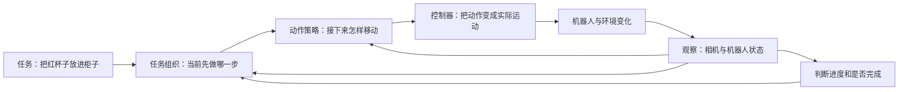

# ① 先用一个任务看懂机器人系统

**这一页只建立框架。** 例子是“把桌上的红杯子放进柜子”。看完能区分训练与运行，以及VLA与完整机器人系统，就可以进入对照表。

## 机器人运行时发生什么？

这是**帮助理解职责的示意图**，不是所有模型都采用的固定架构。有的模型把几项职责合在一起，有的有独立高层模型；也不是所有动作策略都使用flow matching。

| 环节 | 用杯子例子理解 | 在本库哪里看 |
|---|---|---|
| 观察 | 杯子在哪，夹爪在哪，手臂现在是什么姿态 | [数据与代码](../openpi_study/03_PI0_WALKTHROUGH.md) |
| 任务组织 | 先开门，再拿杯子，再放置 | [Gemini的ER与VLA](deepmind/README.md) |
| 动作生成 | 预测下一小段动作数值 | [action expert与flow matching](../openpi_study/07_FLOW_MATCHING_FROM_ZERO.md) |
| 运动执行 | 控制关节；全身机器人还要处理平衡、接触 | [Helix 02](figure/02_helix02.md) |
| 记忆 | 柜门刚才是否已打开，杯子是否已放入 | [MEM](pi/06_mem.md) |
| 成功判断 | 是指定红杯子，且确实放到了目标位置 | [多摄像头成功验证](pi/11_data_quality_three_concepts.md) |

## 模型训练时发生什么？

**记录示范/经验 → 检查数据和标签 → 构造训练样本 → 计算预测误差 → 更新模型参数 → 保存模型。**

以动作学习为例：训练时可以从已记录轨迹取“当时看见什么”和“后面做了什么动作”作为一对样本。运行时没有示范动作答案，模型要根据新观察生成动作。具体生成过程见[flow教程](../openpi_study/07_FLOW_MATCHING_FROM_ZERO.md)。

三件事分开记：**训练更新参数；推理使用参数给出结果；控制器执行结果。** 机器人执行一次动作、更新文字记忆或收到一句新提示，不自动意味着模型又训练了一次。

## 先认识这八个词

| 词 | 第一次阅读先这样理解 |
|---|---|
| VLM | 处理视觉和语言的模型 |
| VLA | 将视觉、语言与机器人动作联系起来的模型 |
| policy／策略 | 根据条件决定动作的方法或模型 |
| action expert／动作专家 | 专门负责动作生成的网络部分；各家不一定都有相同结构 |
| action chunk／动作块 | 一次预测接下来多个控制时刻的动作 |
| embodiment／本体 | 机器人的身体、传感器与动作接口 |
| checkpoint | 保存下来的模型参数；不等于整个部署系统 |
| 泛化 | 训练后面对某种新条件仍能完成任务；必须说明“什么是新的” |

遇到更多词再查[术语表](../openpi_study/GLOSSARY.md)，无需先背完。

## 三条路线应该怎么比？

以**π0的图像/语言/状态 → 连续动作生成**为基准，再逐项看：谁增加了高层推理，谁改变了训练数据，谁加入记忆或图像目标，谁把学习到的全身控制接进系统。具体事实及来源都在[八模型对照表](MODEL_COMPARISON_8.md)。

读表时留意：成功率不等于完成了多少步骤；新家庭不一定是新任务；控制Hz不是完成任务速度；演示一次成功不能证明长期可靠。

**自测：** 看到“相机 → VLA → 动作”后，你能指出哪里还需要控制器、哪里还需要判断任务结束吗？能指出即可继续，不必先懂网络公式。

**下一步：** [② 八模型对照](MODEL_COMPARISON_8.md) · [回首页](../README.md)
