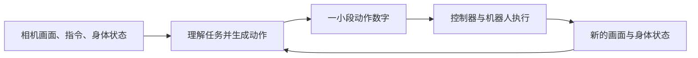
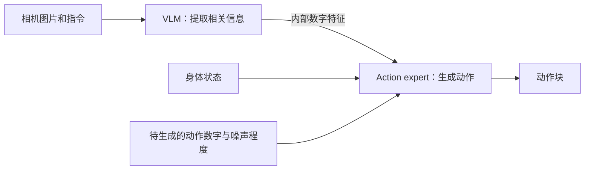
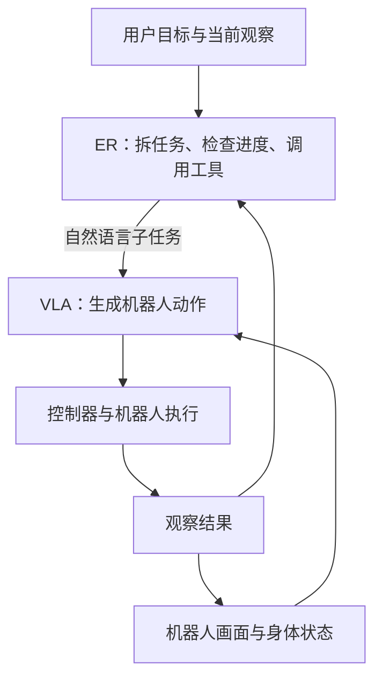
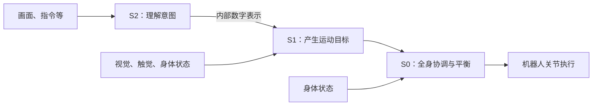

# 零基础入门：机器人怎么从“看见”到“动起来”

[返回首页](../README.md) · [查术语](../openpi_study/GLOSSARY.md)

**先理解每个部分在做什么，再看模型名字。** 本页不用公式，统一用“把杯子放进柜子”解释架构和训练。杯子例子是教学示意，不是各家公司的一项共同实验。资料核对：2026-09-20。

第一次按顺序读；以后可直接跳到：[基本分工](#basics) → [训练是什么](#training) → [PI与flow matching](#pi) → [Gemini与ER](#gemini) → [Figure与Helix](#figure) → [数据差异](#data) → [下一步](#next)。

<a id="basics"></a>
## 1. 先把“看懂、决定、动作、执行”分开

假设你说：“把桌上的杯子放进柜子。”

| 要解决的事 | 白话理解 | 杯子例子 |
|---|---|---|
| 看懂环境和指令 | 弄清物体、位置和目标 | 杯子在桌上，柜门还没打开 |
| 安排步骤 | 决定现在先做什么 | 先开柜门，再拿杯子 |
| 生成动作 | 算出接下来怎样移动 | 手往哪走、夹爪什么时候闭合 |
| 执行和反馈 | 控制硬件，并观察结果 | 电机带动手臂，摄像头确认杯子有没有拿稳 |



这是功能分工图。**一个方框不一定对应一个独立模型**；有的模型把几项功能一起学，有的系统把它们拆开。

先认识四个词就够：

- **VLM，视觉语言模型**：处理图片和文字，能识别杯子、理解“放进柜子”。“看懂”本身还不能让电机转动。
- **VLA，视觉语言动作模型**：进一步输出机器人动作。名字突出视觉与语言，实际往往也输入身体状态。
- **state / 本体状态**：机器人现在的关节位置、夹爪开合等。“现在在哪里”与 action“接下来要怎么动”不同。
- **action chunk / 动作块**：接下来一小段动作数字。可以是关节目标、手的位置和朝向等，具体含义取决于机器人接口；不一定是电机扭矩。

“关节目标”还要交给控制器执行。预测动作、实际运动、判断是否成功，是三件需要衔接的事。

<a id="training"></a>
## 2. “用数据训练”到底在做什么？

可以先理解成：**给模型很多题目和答案，让它的预测逐渐接近训练目标。**

对动作模型，一条示范通常包含：

```text
题目：当时的相机画面 + 当时的身体状态 + “把杯子放进柜子”
答案：示范者在接下来一小段时间内发给机器人的动作命令
```

示范者可以通过**遥操作**控制真实机器人。系统同时记录相机、身体状态和控制命令，这些记录必须在时间上对应。只拍一个人的操作视频，通常拿不到那台机器人的动作命令。

| 阶段 | 在做什么 | 模型参数是否改变 |
|---|---|---|
| 训练 | 用数据算预测误差，再调整模型内部参数 | 会 |
| 部署／推理 | 给新画面与指令，使用已学好的参数生成动作 | 通常不会 |
| 收集经验后再训练 | 把执行、成败、纠错等记录拿回来改进模型 | 会，在训练时改变 |

**预训练**是先学广泛能力，**后训练／微调**是在已有能力上继续适配。它们说的是训练阶段；**模仿学习**和**强化学习**说的是怎样获得学习信号，不能直接一一对应。

例如：模仿学习主要学示范动作；强化学习还利用任务结果、奖励等，学习哪些行为更值得选择。机器人失败后重新观察、换个抓法，可能只是使用已有能力，并不证明它当场更新了参数。

<a id="pi"></a>
## 3. PI：先懂π0，再看各版本增加什么

### 3.1 Action expert是什么？

**Action expert，动作专家，是π模型中负责生成连续动作的神经网络模块。** “专家”不是人工专家，也不是一套人工写好的动作规则。



这是π0的简化图。VLM是理解视觉与语言的主要部分，常叫“主干”。它和动作专家通过模型内部的信息交互协作；**不必先生成一句“我应该拿杯子”，再把那句话翻译成动作**。图中的“数字特征”就是模型对画面和任务的内部表示，先不用研究它的维度。

它学出的动作可能是“手向右靠近、下降、闭合夹爪”，但实际输出是数字，不是这几句中文。

### 3.2 Flow matching是什么？

**Flow matching是训练生成过程的一种方法。π0用它把一组随机数字，逐步变成符合当前任务的动作数字。**

把“动作专家”理解为负责做事的模块，把“flow matching”理解为教这个模块生成动作的方法，就不会混淆。

**训练时：有示范答案。**

1. 从记录里取出正确对齐的一段示范动作。
2. 电脑生成同样大小的随机噪声，将噪声与示范动作按不同比例混合。
3. 根据已知的噪声、示范动作和混合规则，自动算出这条数字变化路径的“变化率”作为标签。
4. 动作专家同时看当前场景、指令、身体状态、混合后的数字和噪声程度，学习预测这个变化率。

**使用时：没有示范答案。**

```text
随机动作数字 → 模型计算怎样调整 → 调整几次 → 得到动作块 → 交给机器人执行
```

这里的“流”可以想成数字空间中的变化路径。上述多次调整在电脑内完成，**机器人不会先执行那些随机动作**。噪声也不是摄像头拍坏的画面。

最小数据仍是“观察、状态、指令、对应动作”。噪声和变化率标签由程序构造，不需要人另拍一批“噪声示范”。具体实现中预测的是向量场，采样方向与训练路径的时间约定有关；等你想看计算时，再读[带手算例子的flow教程](../openpi_study/07_FLOW_MATCHING_FROM_ZERO.md)。

依据：[π0原论文](papers/pi/pi0.pdf)；本库固定版本[训练代码`compute_loss`](../openpi_study/code/src/openpi/models/pi0.py#L228)与[动作生成`sample_actions`](../openpi_study/code/src/openpi/models/pi0.py#L266)。

### 3.3 PI各版本：结构改变与数据改变一起看

| 模型 | 核心结构／分工，白话版 | 训练主要用什么数据，新增什么信息 |
|---|---|---|
| **π0** | VLM理解观察和指令，action expert生成连续动作块 | 先继承VLM图文知识，再学多机器人、多任务示范；困难任务可继续用专项示范训练 |
| **π0.5** | 增加高层子任务预测，再据子任务生成动作；两种能力由同一个模型承载 | 混合更多场景与机器人数据、子任务语言和网络图文等。论文先把动作编码为离散符号预训练，再加入连续动作专家后训练 |
| **π0.6** | 保留高层／低层设计，更新主干、动作专家与训练方式；仍会生成连续动作 | 继承跨机器人、家庭、子任务和图文共训；可用质量等附加标签。采用KI管理不同学习目标之间的影响 |
| **π0.6\*** | 在π0.6基础上，用RECAP学习哪些行为结果更好；训练时另有价值模型 | 除示范外，利用自主执行、成功失败、耗时与人工纠错。由结果估计行为好坏，改进动作策略 |
| **π0.6-MEM** | 加入近期观察历史和长期文字记忆，记住“刚才发生了什么” | 保留连续的历史画面／状态；构造已做步骤、计数等摘要与更新标签。低层仍学动作 |
| **π0.7** | 将历史、语言、质量等附加信息及可选的未来目标图交给VLA；动作专家负责执行 | 混合示范、既有策略执行与纠错、人类视频等。动作学习仍需对应动作；另一个图像生成模块用当前／未来图像关系学习子目标 |

依据与进一步解释：[π0.5论文§IV](papers/pi/pi05.pdf) · [π0.6官方模型卡](https://website.pi-asset.com/pi06star/PI06_model_card.pdf) · [RECAP论文](papers/pi/pi06_star.pdf) · [MEM论文](papers/pi/mem.pdf) · [π0.7论文](papers/pi/pi07.pdf)。**π0.6\*和MEM是两种不同方向的扩展，不要按名字排成必然依次升级。**

表里的**价值模型**，可以先理解为“估计从当前情况继续做，结果会有多好”的评分模型；它自己不输出机械臂动作。

碰到两个旁支词时，先这样理解：

- **FAST**：把一段连续动作压缩成适合逐个预测的离散符号。π0-FAST使用这种动作生成路线；它与flow matching是不同的动作表示／生成方案。π0.5训练配方会利用两种表示，不代表执行时必须先生成FAST再转换成flow动作。[FAST笔记](quick_notes/02_fast.md)
- **KI，Knowledge Insulation**：训练时，阻止连续动作分支的误差信号直接改变VLM主干；主干仍由自己的语言、离散动作等目标学习。它是训练方法，不是又一个负责执行动作的机器人模型。[KI笔记](quick_notes/04_ki.md)

### 3.4 π0.7的世界模型，与动作专家差在哪？

| 模块 | 杯子例子 | 训练时要学习的答案 |
|---|---|---|
| **世界模型／视觉子目标生成器** | 生成“杯子已经在柜子里”的目标画面 | 子任务完成时的图像 |
| **Action expert** | 根据当前情况和目标，生成手臂、夹爪怎么动 | 对应的动作数字 |
| **MEM式记忆** | 记住柜门已经打开、之前抓取失败过 | 历史信息及相应的记忆更新／动作监督 |

**过去发生了什么、未来想变成什么、现在如何行动，是三个不同问题。** π0.7的图像生成器与动作专家都可以用flow matching，但生成的对象不同。前者训练可以利用有合适分段标注的视频；后者的机器人动作监督需要配对动作标签。

π0.7并非每次都必须使用目标图；这里的世界模型也不是一个已经公开证明能任意模拟所有物理接触的仿真器。[原论文Appendix C](papers/pi/pi07.pdf#page=22) · [两类训练样本的详细对照](pi/10_pi07_world_model_vs_action_expert.md)

<a id="gemini"></a>
## 4. Gemini Robotics：ER安排任务，VLA落实动作

### 4.1 ER是什么？

**ER = Embodied Reasoning，具身推理。** 白话说，就是结合真实空间、物体状态和可执行步骤来想问题。

例如：“柜门关着，应该先打开；杯子已经放进去，可以进入下一步。”它也可以指出图中位置、判断进度、调用工具。**知道应该怎么安排，与算出机器人连续动作，是不同能力。**

在Gemini Robotics 1.5的完整系统中：



ER可以把VLA当作一个可调用的工具。ER给“打开柜门”这样的任务，VLA负责具体动作；执行结果再反馈给ER，决定继续、重试还是换步骤。[1.5报告§2](papers/deepmind/gemini_robotics_15.pdf#page=3)

### 4.2 每一代改了什么，用什么训练？

| 模型／分支 | 核心结构／分工 | 数据与训练的关键点 |
|---|---|---|
| **Gemini Robotics（首代）** | ER强化空间推理；动作VLA采用云端主干与本地动作解码器。主干来自经过压缩的ER能力 | VLA使用ALOHA机器人遥操作动作数据，同时混合网络多模态、具身推理等数据。训练继承关系，不等于运行时每次都另调用一个ER规划器 |
| **Gemini Robotics 1.5** | ER 1.5可作高层编排器；VLA自己也可先做贴近动作的文字推理，即Thinking VLA | ALOHA、双臂Franka、Apollo的机器人数据，加网络文字、图像、视频。Motion Transfer让不同机器人之间更好地迁移技能；完整内部训练配方未公开 |
| **Gemini Robotics 2** | 动作VLA扩展全身控制；ER 2负责较长任务和多机器人协调 | 公开了能力与评估，旗舰动作模型的完整数据量、混合比例和损失细节未披露。ER 2模型卡说明：基础Gemini数据加具身推理任务数据 |
| **On-Device / On-Device 2** | 本地运行的动作VLA分支，关注网络依赖和新硬件适配 | On-Device 2披露使用图像、文字、机器人传感器与动作数据；新本体适配还要追加示范。少量适配数据不是从零训练的总量 |

依据：[首代报告§3.1](papers/deepmind/gemini_robotics.pdf#page=14) · [1.5报告§§2.1–2.2](papers/deepmind/gemini_robotics_15.pdf#page=3) · [2系列官方介绍](https://deepmind.google/blog/gemini-robotics-2-brings-whole-body-intelligence-to-robots/) · [ER 2模型卡](https://deepmind.google/models/model-cards/gemini-robotics-er-2/) · [On-Device 2模型卡](https://deepmind.google/models/model-cards/gemini-robotics-on-device-2/)。

“不同机器人”就是**不同本体**：手臂长度、关节数、相机等可能不同。Motion Transfer可以理解为帮助它们共享经验，不能理解成把同一串关节数字原样复制过去。

ER的数据侧重教模型“物体在哪、发生了什么、该安排什么”；动作VLA的数据还要把观察与动作对应起来。这是学习目标的区别，不是声称两者的原始数据绝不重叠。ER各代完整数据配方并未全部公开。

看到**ER 1.6**时，把它放在ER推理分支；不能自动推导出同名的“动作VLA 1.6”。也不要因为Gemini会输出动作，就假设它一定使用与π0相同的action expert或flow matching实现。[相关更新](deepmind/03_updates.md)

<a id="figure"></a>
## 5. Figure：先分清S2、S1、S0，再看Index

### 5.1 三个S在做什么？

| 模块 | 一句话 | 杯子例子 |
|---|---|---|
| **S2** | 理解画面、指令和任务意图 | 这次目标是把杯子放进柜子 |
| **S1** | 结合观察，快速产生运动目标 | 手向杯子靠近，调整抓取姿态 |
| **S0** | 协调全身底层运动、平衡与接触 | 拿杯子、迈步时保持身体稳定 |



这是**Helix 02**的简化结构。首代Helix主要是S2＋S1的上半身控制；S0是Helix 02的关键扩展。S2传给S1的是内部数字表示，不应直接等同于Gemini ER向VLA发送的文字子任务。[Helix首发说明](https://www.figure.ai/news/helix) · [Helix 02说明](https://www.figure.ai/news/helix-02)

### 5.2 三个Helix版本怎么学？

| 模型 | 核心架构／训练变化 | 主要数据区别 |
|---|---|---|
| **Helix（首代）** | 预训练VLM作为S2，连接快速动作策略S1；联合学习动作预测 | 约500小时机器人遥操作，并补写语言指令。首发披露标准回归学习，即预测动作并与示范比较误差；不能写成已采用π0式flow matching |
| **Helix 02** | 扩展到全身，增加S0；S1接收头部／掌心视觉、触觉及身体状态 | S0用超过1,000小时重定向人类运动与仿真强化学习；S1/S2完整配方未披露。S0数据量不代表整套VLA训练量 |
| **Helix 2.5** | 官方重点披露“广泛人类经验预训练，再适配机器人行为”；完整网络结构未披露 | 从随机初始化、仅用Index预训练，再用机器人任务数据分别适配三种行为。不能把旧版S0/S1/S2所有内部规格自动照搬过来 |

**“重定向人类运动”**是把人的运动参考映射为机器人身体能够跟随的运动目标；它与让人遥控机器人采集任务示范不同。

**Index是数据采集与处理体系，不是一个Helix模型。** 它收集人类活动视频，经筛选、去重和文字标注等处理。视频有助于学习环境和行为变化，但不是天然带有机器人关节命令的动作数据。

Helix 2.5由一个基础模型分别适配整理客厅、叠毛巾、铺床，**每种行为各自用固定模型去测试新家庭**；这不是“完全没学过这些家务”，也不是“一个最终模型无条件做完三类任务”。[Index官方说明](https://www.figure.ai/news/introducing-index) · [Helix 2.5官方说明](https://www.figure.ai/news/helix-2-5-zero-shot-30-home-generalization)

<a id="data"></a>
## 6. 数据差异：关键是“这份数据能教什么”

以下是教学归纳。具体版本的已披露用法见上面的表，不代表每家公司都使用了所有类型。

| 手里有什么数据 | 它能直接提供什么监督 | 单靠它还缺什么 |
|---|---|---|
| 图片＋文字／空间问题答案 | 识别、语义、位置关系、推理 | 真实机器人该发什么动作命令 |
| 普通人类操作视频＋任务描述 | 行为顺序、物体变化、视觉经验 | 与目标机器人配对的动作、接触力等标签 |
| 同步机器人轨迹：图像＋state＋action＋指令 | 这个观察下，示范动作是什么 | 若没有结果记录，就难以区分做得好坏 |
| 轨迹＋成功失败、耗时、纠错 | 哪些行为带来更好结果，用于经验学习 | 仍需定义奖励并设计学习方法，不是加一列成功标签就自动完成RL |
| 连续历史＋事件摘要 | 之前发生了什么、还有哪步没做 | 未来目标和具体动作仍需相应监督 |
| 当前图＋任务＋结束图 | 任务完成后的视觉目标 | 如何控制特定机器人到达那里 |
| 人体运动参考＋物理仿真交互 | 身体协调、接触和平衡 | 对具体物体和语言任务的完整理解与执行 |

**同一条机器人记录可以切成不同教材。** 比如一段完整的放杯子记录：

- 取当前画面和随后动作，教动作策略。
- 取当前画面和子任务末尾画面，教未来目标图生成。
- 保留前面已开门、已抓取等信息，教记忆。
- 加上成败与纠错记录，支持从结果学习。

因此“都用了机器人数据”不代表样本、标签和学习目标一样；“都用了人类视频”也不代表都不需要机器人动作数据。

比较数据量时，先问：是**总预训练数据**、**某个子模块数据**，还是**新任务／新机器人的追加数据**？人类视频小时、机器人轨迹小时、仿真交互步数也不能直接互换。

<a id="next"></a>
## 7. 现在应该怎么继续读？

先确认自己能回答这四个问题：

1. **Action expert与flow matching有什么区别？** 前者是模块，后者是训练生成过程的方法。
2. **ER与动作VLA有什么区别？** 前者重在理解和安排，后者把指令与观察变成机器人动作。
3. **世界模型画出杯子进柜子，是否等于机器人已经会做？** 不等于，仍要生成动作、执行并检验结果。
4. **人类视频与机器人示范差在哪？** 前者通常没有那台机器人的配对动作命令；后者可记录这类监督。

能答出来，就从[Figure入门路线](figure/README.md)开始，再读[DeepMind](deepmind/README.md)、[PI](pi/README.md)。需要比较数字时再打开[八模型表](MODEL_COMPARISON_8.md)。

想进一步弄懂动作生成：读[flow手算教程](../openpi_study/07_FLOW_MATCHING_FROM_ZERO.md)，再跟[π0代码](../openpi_study/03_PI0_WALKTHROUGH.md)。本库代码学习仍只覆盖π0与π0.5。

[返回首页](../README.md) · [继续：系统完整流程](00_OVERVIEW.md)
