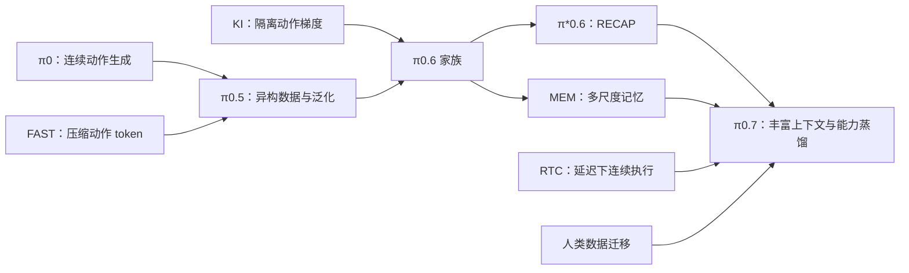

# Related work：从 VLA 到完整机器人系统

核对日期：2026-09-18。适合已经仔细读过 π0、π0.5、π0.7，开始深入 Gemini Robotics 与 Helix 的读者。

## 先建立六个问题

1. **监督来自哪里？** 机器人示范、人类视频、网页图文、自主执行、人工纠错分别教模型什么？
2. **动作怎么表示？** 单步离散 token、压缩动作块、连续 flow、关节目标、执行器命令不能混为一谈。
3. **谁决定下一步？** 高层文本子任务、连续语义 latent、视觉子目标有不同的可解释性和控制粒度。
4. **哪些信息被记住？** 当前画面、短时运动历史、长期任务状态解决不同的部分可观测问题。
5. **模型计算期间机器人做什么？** 推理延迟、动作块切换和伺服频率是实际运行的一部分。
6. **什么算成功？** 环境泛化、任务泛化、物体泛化、跨本体迁移、成功率和 progress score 分开记录。

## 核心阅读地图

| 路线 | 阅读卡片 | 重点 |
|---|---|---|
| PI 基础 | [π0](pi/01_pi0.md) | VLM 与连续动作 flow 如何结合 |
| PI 动作表示 | [FAST](pi/02_fast.md) | 为什么逐维离散化在高频动作上失效 |
| PI 泛化 | [π0.5](pi/03_pi05.md) | 异构数据和高低层推理 |
| PI 训练机制 | [Knowledge Insulation](pi/04_knowledge_insulation.md) | 梯度流与训练/推理解耦 |
| PI 经验学习 | [π*0.6 / RECAP](pi/05_recap.md) | 自主数据、纠错、价值估计闭环 |
| PI 时间上下文 | [MEM](pi/06_mem.md) | 短期视觉与长期文本记忆 |
| PI 综合系统 | [π0.7](pi/07_pi07.md) | 语言、metadata、视觉目标、历史和 RTC |
| PI 缺失环节 | [Hi Robot、RTC、human-to-robot、RLT](pi/08_supporting_work.md) | 把版本之间的机制补齐 |
| DeepMind 起点 | [Gemini Robotics](deepmind/01_gemini_robotics.md) | ER 与 VLA 各自负责什么 |
| DeepMind 核心 | [Gemini Robotics 1.5](deepmind/02_gemini_robotics_15.md) | ER orchestrator、Thinking VLA、Motion Transfer |
| DeepMind 更新 | [On-Device 与 ER 1.6](deepmind/03_updates.md) | 部署路线与具身推理更新 |
| Figure 起点 | [Helix](figure/01_helix.md) | latent 接口与异步双系统 |
| Figure 全身控制 | [Helix 02](figure/02_helix02.md) | S2 → S1 → S0 的频率与输出边界 |
| Figure 最新进展 | [Go-Big、Index、Helix 2.5](figure/03_data_and_helix25.md) | 人类数据预训练与新家庭泛化 |
| 背景基线 | [ACT、Diffusion Policy、RT-2、OpenVLA、Octo](foundations/README.md) | 理解这些设计的技术来源 |

## 不把版本链误读成单一升级方向

图中箭头表示本库整理的机制联系，不表示每项工作是前一版本的直接继承实现。特别是 FAST、KI、MEM、RTC 都有独立的研究问题。

## 建议的第一轮顺序

**FAST → KI → Gemini Robotics 1.5 → Helix → Helix 02 → RECAP → MEM → RTC → 重读 π0.7。**

π0 和 π0.5 用来回查公式与架构，不必从摘要重新开始。Helix 2.5 于 2026-09-17 发布，本库纳入官方披露，但目前不能把它当作已经独立复现的结论。

## 使用方式

- [WORKFLOW](WORKFLOW.md) 是调研过程；[COMPARISON](COMPARISON.md) 是模型运行流程的横向对照。
- [LEARNING_PATH](LEARNING_PATH.md) 给出学习产出和可执行的小实验；本次只完成调研，没有训练或部署模型。
- [SOURCES](SOURCES.md)、[sources.json](sources.json) 提供原始资料、PDF 页数与 SHA-256；PDF 文件名经过统一，但用户提供的原始文件内容保持不变。
- 新增工作使用 [笔记模板](templates/PAPER_NOTE.md)。
