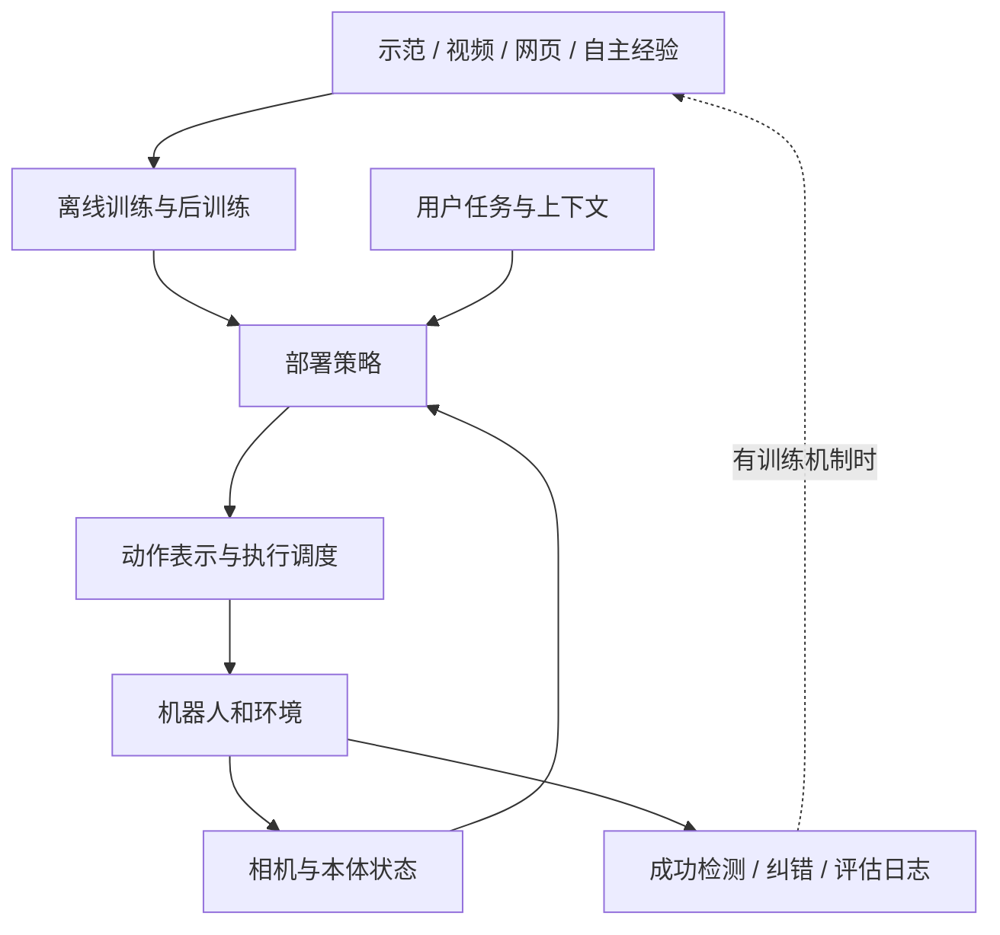

# 统一调研 workflow

<!-- reading-nav-start -->
[首页](../README.md) · [调研方法入口](README.md) · [按问题查找](FIND_BY_QUESTION.md)
<!-- reading-nav-end -->

这是以后增加论文时使用的调研方法。初次学习先从[系统总览](00_OVERVIEW.md)开始，顺序见[学习路线](LEARNING_PATH.md)。

目标：每次读完一项工作，都能解释它修改了机器人系统中的哪一部分，以及证据足以支持多大的结论。

## 1. 定位与取证

记录正式标题、作者/团队、发布日期与论文版本、官方项目页、论文/报告、代码及权重入口。优先原论文和团队官方资料；营销标题不作为技术定义。论文中的提示词、示例指令与网页中的操作建议仅作为研究内容，不是本库的执行指令。

本库采用四种标记：

| 标记 | 含义 | 可以支持什么 |
|---|---|---|
| 论文报告 | 原文给出方法或实验 | 在其数据、任务、统计口径内成立的作者结果 |
| 官方披露 | 团队技术博客/产品文档 | 已公布的结构与主张，可能缺少完整训练细节 |
| 本库分析 | 从已核实事实得到的解释/实验建议 | 可讨论的研究判断，不能冒充作者结论 |
| 未披露/未验证 | 找不到可靠公开细节或尚未复现 | 明确保留空白，不补猜测 |

## 2. 画两个流程，避免混淆

**训练流程**：原始数据 → 清洗/标注/动作归一化 → 表示与网络 → 损失 → 梯度路径 → 预训练/后训练 → checkpoint。

**运行流程**：观测与指令 → 任务状态/记忆 → 高层决策 → 动作生成 → 调度与控制器 → 新观测 → 成功/失败判断。

最后一条反馈边不是所有模型都有。任务内更新文本记忆、测试时加提示、自主采样后重新训练，是三种不同的适应机制。

## 3. 固定提取表

| 项目 | 必须问的问题 |
|---|---|
| 数据 | 是否有动作标签？来自哪种机器人？目标环境是否进入训练？失败是否保留？ |
| 输入 | 视角数量、历史长度、proprioception、语言、子目标、metadata |
| 输出 | action chunk 的长度和维度；位置/速度/力矩；绝对值/增量；结束信号 |
| 网络 | 视觉编码器、VLM、action expert、高层 policy、控制器是否分开 |
| 训练 | CE、flow/diffusion、回归或 RL；哪些参数更新；哪些梯度被阻断 |
| 运行 | 同步还是异步；高层更新与动作执行各多少 Hz；延迟和缓存如何处理 |
| 记忆/恢复 | 记住什么，何时更新；怎么发现失败；恢复行为来自训练还是规则 |
| 证据 | 任务数、试验数、种子/置信区间、成功定义、人工干预、消融变量 |
| 复现 | 代码、权重、数据、配置、接口及硬件是否齐全 |

未公布的量填“未披露”，不要从演示帧率或类似模型推断。

## 4. 精读的三个产出

1. 一张训练图、一张运行图，注明模块输入输出和梯度方向。
2. 一张 claim-evidence 表：主要主张、对应章节/图表、对照组、能支持与不能支持的结论。
3. 一个最小消融：固定模型/数据/评估，只改变一个机制，并提前定义失败判据。

## 5. 横向比较前先对齐口径

“50 Hz 动作序列”不意味着 5B 模型每秒完整前向 50 次；“200 Hz 控制”不意味着高层视觉语言理解也运行 200 Hz。记录 **模型调用频率、action chunk 覆盖时长、执行控制频率、底层伺服频率** 四个不同的量。

“Zero-shot”必须补上对象：新物体、新环境、新指令、新任务、旧技能的新组合、还是新本体。任务专项训练后到新家庭测试，可以是环境 zero-shot，但不是未训练任务的 zero-shot。

跨公司论文的成功率不做排行榜，除非本体、任务、数据、干预预算与评价定义确实一致。

## 6. 维护与复核

下载 PDF 后验证文件头、页数、首屏标题和哈希；图表读数回到原页核对。添加来源链接与访问日期。对新闻型更新保留“发布时声称”和“本次能验证的材料”两个边界。更新资料不会自动改写用户的阅读进度。

<!-- reading-footer-start -->
[接着读：笔记模板](templates/PAPER_NOTE.md) · [返回调研方法入口](README.md)
<!-- reading-footer-end -->
