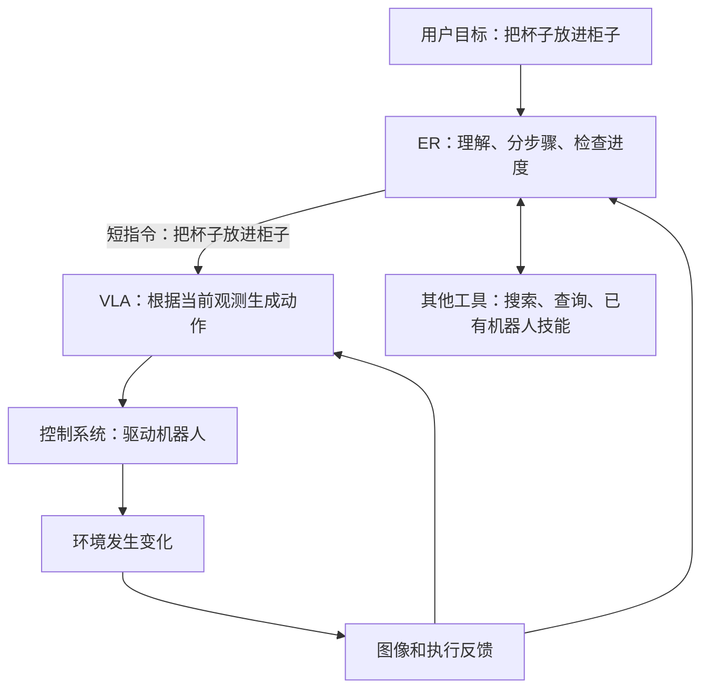

# 先用一件事看懂：让机器人把杯子放进柜子

[DeepMind 学习入口](README.md) · [下一篇：技术路线怎么走到今天](00_technical_lineage.md)

**先记一句话：看懂世界、决定做什么、产生动作、真正执行，是四件相互连接的事。** Gemini Robotics 是一个模型家族；名字里带 ER 的模型与直接产生动作的 VLA，职责不同。

## 1. 沿着同一个任务走一遍

下面是帮助理解的例子，依据 Gemini Robotics 1.5 的系统分工，不是论文中某次实验记录。

| 步骤 | 杯子例子 | 谁主要负责 |
|---|---|---|
| 理解目标和现场 | 用户要收杯子；杯子在桌上，柜门关着 | ER：具身推理模型 |
| 安排步骤 | 先开柜门，再拿杯子，再放进去 | ER：任务编排器 |
| 把短指令变成动作 | 根据相机和机器人状态，决定手臂、夹爪怎样动 | VLA：动作模型 |
| 驱动真实机器 | 将动作目标转成机器能执行的控制，并检查约束 | 机器人控制系统 |
| 判断结果 | 杯子是否真的进柜？失败要重试还是换计划？ | 传感器反馈、ER／成功检测模块与执行系统 |

**这是一种系统组合，不是每次调用 Gemini 都一定经过的固定流水线。** 简单任务可以直接给 VLA 指令；ER 也可以调用已有控制 API，不必使用 Gemini 的 VLA。[依据：1.5 报告 §2.1](https://arxiv.org/abs/2510.03342)

## 2. 六个词，先分清层次

| 词 | 大白话 | 不要误会成 |
|---|---|---|
| Transformer | 把输入信息结合上下文加工的一种网络结构 | 某个机器人功能或训练方法 |
| VLM | 能结合图像和语言理解、回答问题的模型 | 自动具备可靠抓取能力 |
| ER，Embodied Reasoning | 面向物理场景的推理：在哪、怎么放、先做什么、是否完成 | 只服务人形机器人，或必然直接输出电机指令 |
| VLA | 把视觉、语言等观测转为机器人动作的模型 | 一定用自回归，或一定用 flow matching |
| Action decoder／action expert | 生成动作的模块；各论文的实现可能不同 | 只因名字相似，就认定 Gemini 与 PI 结构相同 |
| Controller | 使机器执行动作目标的控制系统 | 和上层模型合为一个黑箱、无需单独核查 |

Transformer 细节先读全库的[零基础概念课](../00_START_HERE.md#transformer)。这里只需知道：**架构是“计算的骨架”，训练是“怎样学”，输出方式是“怎样给答案”**，三者不能互相替代。

## 3. 什么叫“学会”，什么叫“正在做”？

**训练：** 给模型很多“现场 + 指令 + 正确答案”，比较预测与答案的差距，更新模型参数。答案可以是物体位置、下一步文字，也可以是机器人动作。

**推理：** 参数已经准备好。现在输入现场和指令，让模型给出判断或动作。官方 ER notebook 主要展示这一过程。

**ICL：** 推理时再提供几个示范，模型参考这些示范回答；不因此更新参数。**微调：** 用新数据继续训练，参数真的改变了。两者都可能用少量示范，但机制不同。

| 想教会什么 | 教学用数据例子 | 模型要输出什么 |
|---|---|---|
| 杯子在哪 | 图片 + 问题 + 标注坐标 | 点／框／文字 |
| 怎样收杯子 | 场景 + 目标 + 合理步骤 | 计划／工具调用 |
| 手怎样抓杯子 | 连续图像、机器人状态、指令、对应动作记录 | 动作数字或动作片段 |

这张表解释数据与目标的关系，**不代表已知 Google 内部各类数据的确切占比或全部损失函数**。实际版本的披露见[训练和数据](05_training_and_data.md)。

## 4. 为什么框住杯子还不等于抓住杯子？

Bounding box 是图片里的矩形框：告诉系统“目标大概在这一块”。抓取还涉及距离、朝向、接触位置、手臂能否到达、抓多紧等信息。

例如 ER 返回 `[200, 300, 600, 700]`，在本教程 notebook 中表示归一化的 `[上, 左, 下, 右]`。它不是四个关节角，也不是一个三维抓取姿态。完整手算见[代码导读](04_er_notebook_walkthrough.md)。

## 5. 怎样理解各代变化？

| 工作 | 优先记住什么 | 深读入口 |
|---|---|---|
| Gemini Robotics，2025 | ER 做具身推理；VLA 学会灵巧动作；初代有云端骨干 + 本地动作解码器 | [初代](01_gemini_robotics.md) |
| Gemini Robotics 1.5 | ER 编排长任务；VLA 也能先思考；Motion Transfer 帮助跨机器人迁移 | [1.5](02_gemini_robotics_15.md) |
| Gemini Robotics 2 系列 | 动作能力扩展到全身与更复杂操作；ER 2 规划协调；On-Device 2 面向本地运行 | [2 系列及分支](03_updates.md) |

上表是学习概括。**“扩展了能力”不表示这些问题已经全部解决。** 不同版本的评测任务、适配条件与访问权限仍需分别看。

## 看懂的标志

你能解释：ER 可以说“杯子在这里、先开门”，VLA 要把短指令变成动作，控制系统负责执行；执行后仍要看结果。接下来才问：**哪一层出错、哪种数据能改善、实验是否证明了改善？**

[下一篇：SayCan → RT-1 → PaLM-E → RT-2／RT-X → Gemini](00_technical_lineage.md) · [来源总表](08_sources.md)
