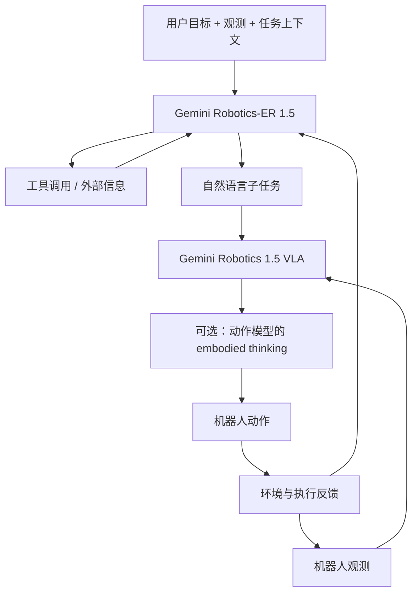

# Gemini Robotics 1.5：编排器、Thinking VLA 与跨本体迁移

<!-- reading-nav-start -->
[首页](../../README.md) · [DeepMind入口](README.md) · [按问题查找](../FIND_BY_QUESTION.md)
<!-- reading-nav-end -->

**阅读优先级：最高。** [原报告](../papers/deepmind/gemini_robotics_15.pdf) · [arXiv](https://arxiv.org/abs/2510.03342)。先读 Section 2（PDF pp.3–4），再读 Sections 3、5（pp.17–19）与 Appendix D。

**核心大纲：问题 → 三项方法 → 数据 → 消融实验 → 指标边界。**

## 论文要解决什么问题？

已经会执行短指令，还不等于能稳定完成长任务；一种机器人的经验，也未必能帮助另一种身体。1.5 同时研究跨本体学习、动作前推理，以及把短动作组织成多步任务。

## 三项不同的贡献

1. **Motion Transfer（MT）**：多本体训练与结构设计支持不同机器人间的技能迁移。
2. **Thinking VLA**：动作模型自己也能先生成自然语言思考，再输出动作。
3. **ER 编排器**：Gemini Robotics-ER 1.5 负责长任务规划、工具调用、进度与成功检测。

三者分别作用于训练迁移、动作模型内部推理和完整任务系统。**ER 像负责整件事的协调者；Thinking VLA 像执行当前步骤时也会先考虑怎样下手的人。** 这是教学比喻，帮助分清两层推理，不代表两个模块具有固定的人类认知结构。

## 训练 workflow：已知与未知

报告列出的机器人数据来自 ALOHA、双臂 Franka 和 Apollo，另含互联网文本、图像和视频。MT 的公开表述是多本体结构与训练配方，报告通过有/无 MT 和单/多本体对照评估效果。

**未充分公开：** 用于完全重建 MT 的所有结构、损失、数据配比，以及所有模型的精确大小和底层控制实现。不能补写成“统一关节坐标后做 flow matching”。训练数千类任务与“某个新本体零数据即可泛化”也不等价。

## 运行 workflow

ER 把 VLA 作为一个可调用工具，并根据成功检测切换步骤。Thinking VLA 的思考可细化几秒钟的动作或空间关系，但它不是完整 ER 编排器的替代品。公开的自然语言思考记录提供可检查线索，也不能单独证明解释完整反映内部决策机制。

## 最值得细读的实验

| 实验 | 隔离的变量 | 应读位置 |
|---|---|---|
| MT / no-MT；单本体 / 多本体 | 技能迁移配方的贡献 | Section 3.2 |
| thinking on/off | 动作模型内部思考的作用 | Section 3.3 |
| 通用 Gemini 编排器 / ER 编排器 / 单独 Thinking VLA | 高层具身推理与系统组合的价值 | Section 5、Figure 17 |
| 仿真与真实机器人排序一致性 | 开发期间评估代理是否可靠 | Section 2.3、Appendix B |

报告说明开发过程超过 90% 的 evaluation episodes 在仿真中完成，同时强调仍需真实机器人测试。这是开发流程的比例，不是说正式比较的所有结果都是仿真数字。真实机器人比较使用交错 A/B/n 测试来降低场景变化造成的差异。

**最需要辨认的“零样本”：** 某项任务在源机器人上训练过、目标机器人没练过该任务，不等于目标机器人身体从未出现在训练中。多本体迁移实验应核对这个任务在每种身体上的训练覆盖，不能概括成“给任意新机器人就能用”。

## Table 1 的正确读法

原报告 PDF 第 19 页的长任务**子任务失败分类**：

| 失败类型 | Gemini 2.5 Flash 编排 | GR-ER 1.5 编排 |
|---|---:|---:|
| 规划 | 25.5% | 9% |
| 成功检测 | 6% | 4% |
| 动作执行 | 13% | 9% |
| 合计 | 44.5% | 22% |

这些是该实验中子任务失败口径，不是跨所有机器人的通用失败率，也不能用 100% 减去它当作完整任务成功率。Figure 17 的 progress score 与 Appendix D 的任务成功率应分开。

Section 5 脚注还明确：ALOHA 使用预训练 checkpoint，而双臂 Franka 为长任务另做后训练。因此不能把整组长任务结果写成“所有平台统一 checkpoint、无需后训练”。

## 下一步的公开研究方向

报告结尾（PDF p.22）指出：1.5 的架构已具备从无动作标注的人类／合成视频中学习的能力，更大规模、低质量公开视频的利用仍是后续方向。**这不是说视频天然带机器人动作标签，也没有给出该类数据的完整训练配方与独立收益表。**

同一段还明确：泛化进步后，灵巧性仍与前代相当；团队提出探索包括 RL 在内的新方法，在不牺牲通用性的前提下改善精细操作。因此不能把“更通用”直接写成“每一种精细任务都更可靠”，也不能把未来 RL 方向当作这一代已披露的完整训练流程。

## 你能研究与复现什么

**本库建议：** 最容易独立研究的是 orchestrator 接口和失败分解：固定一个可用动作策略，比较高层计划、结束检测和失败恢复。实际用替代 VLA 或其他 ER 模型做实验时，要称为“受 Gemini workflow 启发的实现”，不能声称复现原闭源模型。

开放访问的 ER API 与受限访问的完整 VLA 是两回事；最新变化见 [更新说明](03_updates.md)。接口怎样连接，继续看[官方 ER notebook 导读](04_er_notebook_walkthrough.md)；MT 的数据与未知实现见[训练专题](05_training_and_data.md)。

<!-- reading-footer-start -->
[前一篇：Gemini Robotics](01_gemini_robotics.md) · [接着读：Gemini Robotics 2及相关更新](03_updates.md) · [返回DeepMind入口](README.md)
<!-- reading-footer-end -->
