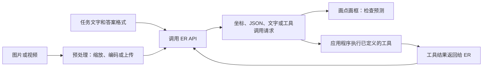

# ER 代码导读：一张图怎样变成坐标、判断和工具调用？

[学习入口](README.md) · [官方 notebook 最新版](https://github.com/google-gemini/robotics-samples/blob/main/Getting%20Started/gemini_robotics_er.ipynb) · [本次核对的固定版本](https://github.com/google-gemini/robotics-samples/blob/c51cbab6e6efffff8738ecf9ce41ba85034d9654/Getting%20Started/gemini_robotics_er.ipynb)

**先知道它是什么：这是调用 ER 的示例，不是训练 Gemini Robotics VLA 的源码。** 当前 notebook 标题为 **Gemini Robotics ER 2**，使用 `gemini-robotics-er-2-preview` 和 `client.interactions.create(...)`。不能把它按旧 ER 1.5 教程原样理解。

核对日期：2026-09-24；固定提交：`c51cbab6e6efffff8738ecf9ce41ba85034d9654`，2026-08-04。本文 cell 编号从 **0** 开始，包含 Markdown 单元格；也提供可直接搜索的标题／函数名。上游变动后，优先按名称定位。

## 先跟这条线，不必一次读懂所有 Python



**模型负责预测，Python 负责准备输入、发请求、解析答案和执行工具。** 没有优化器、训练损失与参数更新步骤。调用 API 也不会把 ER 权重下载到你的电脑。

## 1. 全 notebook 阅读地图

建议第一次只读带 ★ 的行。其他例子是同一模式的扩展，不必当作新架构重学。

| Cell | 原文定位 | 这一段在做什么 | 先看什么 |
|---|---|---|---|
| 0–2 | Copyright／License／Quickstart | 版权、Apache 2.0、介绍和 Colab 入口 | 知道原始来源 |
| 3–6 ★ | Setup／`MODEL_ID` | 安装 `google-genai>=2.9.0`、读取密钥、建客户端、首次请求 | 分清 SDK、模型名、API 三件事 |
| 7–9 ★ | Utilities／`load_image` | 导入库、图片编码、坐标可视化 | 读 `load_image` 和画点时的坐标转换 |
| 10–23 ★ | Spatial Understanding／Pointing | 找任意物体、指定物体、部件；多点与计数 | 精读 13，再比较 15、17；21 演示并行请求 |
| 24–27 ★ | 2D Bounding Boxes／`BBoxItem` | 找物体／货架的二维框 | 25 的坐标顺序与 JSON schema |
| 28–39 | Trajectories、Making room 等 | 画二维路径、绕障、腾空间、装午餐、找插孔等 | 路径和常识建议仍不是已验证的机械运动 |
| 40–43 ★ | Multi-view Correspondence & Success Detection | 用开始时 4 张图、当前 4 张图判断任务是否完成 | 43 的输入顺序与 `success` 字段 |
| 44–57 | Agentic Vision | 读钟表／仪表、看芯片、图像标注与分组 | 先看 53／55／57 怎样配置工具；不要假定本节每个例子都调用了代码执行 |
| 58–60 ★ | Task Orchestration／`move` | ER 调用模拟机器人函数，并收到工具回执 | 60 的函数定义、工具声明、调用循环 |
| 61–67 ★ | Video Progress／`previous_interaction_id` | 上传视频、按时间描述、结合上一轮追问 | 66→67 如何保持会话上下文 |
| 68–73 | Moment Finding | 找视频中的关键时刻，整理视角并展示 | 时间定位与空间定位是两种输出 |
| 74–81 | Progress Classification | 将进度分为百分比区间或语义阶段 | 79 与 81 的标签定义不同 |
| 82 | Next steps | 指向官方开发文档 | 以当前文档核对接口 |

## 2. 第一个真正需要看懂的例子：找点（cell 13）

按这七步读代码即可：

1. `PointItem` 定义一个答案项：物体名字 `label` 和点坐标 `point`。
2. `PointResponse` 定义整个答案：多个答案项放在 `items` 中。
3. `load_image(...)` 读取图片，把宽度改成 800，保持长宽比，转为 PNG 的 base64 字符串。
4. `prompt` 用文字告诉 ER 要找什么。
5. `client.interactions.create(...)` 把图像、文字和输出格式发送给模型。
6. `response.output_text` 取回输出；schema 约束结构，但不会保证物体找得对。
7. `plot_points(...)` 把结果画回图片，方便人检查。

**Pydantic 是定义数据结构的 Python 工具。** `model_json_schema()` 把结构描述转换成 API 可以接受的格式规则。你写 `point`、`label`，不是新训练了一个检测模型，而是在约定“答案应该怎么填”。

**base64 只是传输图片的一种编码，不是视觉 token，也不是训练。** 宽度缩放也不等于已经处理完相机标定、畸变或跨机器人视觉差异。

## 3. 点和 bounding box：手算一次就不容易混

此 notebook 中，点是 **`[y, x]`**，框是 **`[ymin, xmin, ymax, xmax]`**，数值相对图像尺寸归一化到 **0–1000**。

假设预处理后图像宽 800、高 600：

| 输出 | 怎样还原 | 结果 |
|---|---|---|
| 点 `[250, 750]` | 横坐标 = 750/1000×800；纵坐标 = 250/1000×600 | 图像上的 `(x=600, y=150)` |
| 框 `[200, 300, 600, 700]` | 左 = 300/1000×800；上 = 200/1000×600；右 = 700/1000×800；下 = 600/1000×600 | 左上 `(240,120)`，右下 `(560,360)` |

如果之后裁剪、旋转图片，必须跟踪新的坐标系；不能直接把裁剪图的坐标当成整图坐标。

**框回答“哪里是这个物体”，不直接回答“夹爪该怎样抓”。** 从二维图像位置到真实控制，系统通常还需要深度／几何、相机与机器人坐标变换、可达性和碰撞处理、控制器等。具体由什么模块做，取决于机器人系统；这个例子没有把它们全部实现。

## 4. 多摄像头判断成功（cell 43）

任务是把芒果放进棕色容器。程序依次发送：

```text
开始：视角 1、2、3、4
当前：视角 1、2、3、4
文字：比较两组图，现在完成任务了吗？
输出：{"success": true} 或 {"success": false}
```

多视角可能缓解遮挡，前后对比帮助判断变化。但它仍是**模型对图像的判断**，不是传感器测得的绝对真值。物体仍被手抓住、只是遮住了容器、或放下后又滑落，都可能造成误判。

这不是“4 个模型投票”，也没有展示一个必须先做三维重建的管线。不要把这个示例当作 PI 内部质量检查已经如此实现的证据。

## 5. 最重要的区别：调用工具，不等于已经有动作模型（cell 60）

这一段包含两层“函数”：

| 代码部分 | 谁读／谁执行 | 用处 |
|---|---|---|
| `def move(x, y, high)` | 本地 Python 执行 | 实际函数体只有打印信息 |
| `move_function` | 提供给 ER | 告诉模型工具名称、用途、参数格式 |
| `step.type == "function_call"` | 本地程序读取模型响应 | 发现模型希望调用哪个工具 |
| `move(**arguments)` | 本地程序派发 | 把参数交给对应函数 |
| `function_result` | 返回给 ER | 告诉模型工具的执行结果 |
| `previous_interaction_id` | 下一次 API 请求使用 | 接着上一轮对话，决定后续步骤 |

**此例的 `move` 和 `setGripperState` 是 mock（模拟函数）。** 它们没有连接机器；回执中的 `{"status":"success"}` 也是示例写进去的，不是机器人真实完成了动作。`max_steps=15` 限制循环次数，不能当作运动安全验证。

坐标按一个人为设定的图像原点计算相对位置；这不等于完成了手眼标定或米制三维运动规划。

真实应用还要让工具接入已有机器人能力、检查参数、返回真实执行状态，并根据新观测判断结果。**不能只把打印函数改成电机调用，就认为官方 notebook 的示例已经验证了整套控制系统。**

## 6. Agentic Vision 的“写代码”又是什么？

它指模型借助代码工具处理或检查视觉信息，例如裁剪、放大、标注，再结合结果判断。它与调用 `move` 这样的机器人工具是不同用途，也不等于训练 VLA 的动作专家。

阅读时检查具体请求有没有配置代码执行工具，而不是只看章节标题。`thinking_level` 控制推理设置；更高设置可能增加延迟，它不是机器人控制频率。[当前 ER 开发文档](https://ai.google.dev/gemini-api/docs/robotics-overview)

## 7. 视频理解、上下文与“学习”

Cell 66 先描述视频步骤，67 再用 `previous_interaction_id` 追问第 15–22 秒。模型能够沿用上轮上下文，**不表示刚刚更新了权重，也不能仅凭这一功能就认定完成了新动作技能 ICL**。

最后两项也不是“成功率”：

| Cell | 答案含义 | 容易误读之处 |
|---|---|---|
| 79 | 选 1–5，对应进度区间 0–20、21–40、41–60、61–80、81–100 | 选 5 不等于实测 100% 成功，也不等于成功概率 100% |
| 81 | 选 1–4：未成功、部分完成、接近完成、完美完成 | 是当前视频的分级判断，不是重复试验的成功率 |

## 8. 初学者的三轮练习

| 轮次 | 做什么 | 学到什么 |
|---|---|---|
| 第一轮，不运行 API | 跟读 13、25；手算一个坐标；找到图片怎样进入请求 | 输入→预测→输出格式→可视化 |
| 第二轮，自选 API 练习 | 换一张普通物体照片，比较“找杯子中心”与“框住杯子” | 同一 ER 可以承担不同视觉任务；错误需要人核对 |
| 第三轮，仍用 mock | 跟读 60，分别找到工具声明、派发、回执；解释假成功的问题 | 模型规划与工程执行之间的接口 |

自行运行时需要自己的 API 访问权限和密钥，调用可能计费；密钥放在 Colab Secrets 或环境变量中，别写入 GitHub。本文完成了源码核对，**未调用付费 API、未执行机器人硬件，也不声称实测复现了官方成功率**。

[下一篇：这些能力如何训练](05_training_and_data.md) · [准备与专家沟通](07_expert_conversation.md)
