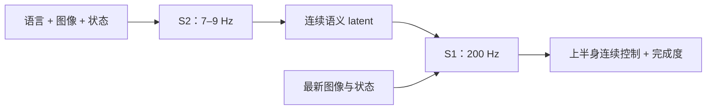

# Helix：连续 latent 连接语义与高速控制

<!-- reading-nav-start -->
[首页](../../README.md) · [Figure入口](README.md) · [按问题查找](../FIND_BY_QUESTION.md)
<!-- reading-nav-end -->

**材料性质：官方技术说明，非完整可复现论文。** [官方原文，2025-02-20](https://www.figure.ai/news/helix)。重点读 Model and Training Details 与 Optimized Streaming Inference。本次未在该官方材料中找到可下载的独立论文、训练代码或 Helix 权重。

## 官方披露的 workflow

训练数据约 500 小时遥操作，以 VLM 为视频片段生成事后语言指令。S2 使用 7B VLM，将图像、状态和指令压为连续 latent；80M S1 结合这一 latent 与更及时的视觉/状态生成上半身控制。以连续动作回归端到端训练，梯度从 S1 经 latent 回到 S2；训练中加入与部署延迟匹配的时间偏移。[来源](https://www.figure.ai/news/helix)

官方说明两系统在端侧异步运行，并输出任务完成度辅助行为切换。该技术页主要展示新物体与协作能力；完整试验分布、失败统计和训练实现没有全部公开。[来源](https://www.figure.ai/news/helix)

## 本库分析：真正要学的是接口

自然语言子任务接口容易检查和替换，latent 接口可以携带更丰富而紧凑的条件，但语义难以直接审计。这个权衡值得研究，不意味着任何一方天然更优。

Helix 与 KI 最直接的差异在训练梯度：前者公布的是联合反传，后者隔离 action expert 对 backbone 的梯度。要比较其优劣，需控制数据、主干、任务和预算；仅比较公司演示无法得到因果结论。

## 精读与可检验问题

1. S2 的 latent 更新慢时，S1 靠什么观测纠正动作？
2. 对最新观测的响应来自低层闭环，还是高层重新解释目标？
3. 完成度输出若提前判定结束，会怎样影响长任务？
4. 同一 latent 在不同机器人状态下，是否仍能表达可执行目标？

**建议实验：** 在可控替代系统里固定低层 policy，注入不同的高层延迟，分别测动作响应与任务语义正确率。这是机制实验，不是原始 Helix 的复现。

<!-- reading-footer-start -->
[接着读：Helix 02](02_helix02.md) · [返回Figure入口](README.md)
<!-- reading-footer-end -->
