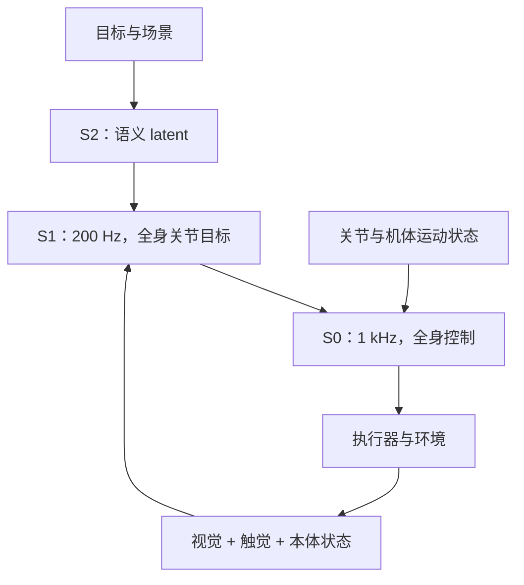

# Helix 02：把语义、移动操作与全身控制分层

**材料性质：官方技术说明。** [官方原文，2026-01-27](https://www.figure.ai/news/helix-02)。本次未获得公开训练代码/权重或可完整复现的技术报告。

## 官方披露的架构与训练

Helix 02 在 S2/S1 之下加入 S0。S2 提供语义 latent；S1 在 200 Hz 生成全身关节目标；S0 以 1 kHz 处理全身协调并输出执行器命令。S0 约 10M 参数，使用超过 1,000 小时重定向的人类运动数据及仿真强化学习训练。S1 接收头部/手掌相机、触觉与本体状态。[来源](https://www.figure.ai/news/helix-02)

官方展示约四分钟洗碗机操作以及触觉辅助精细操作。这些支持系统能连续结合移动与操作的展示性主张，但不能从单次视频推出任意家庭环境的总体成功率。[来源](https://www.figure.ai/news/helix-02)

## 本库分析：与 PI 比较时先对齐层级

PI 论文中的 action expert 主要讨论动作生成；S0 讨论身体稳定、接触与执行器层。若只把二者参数量与 Hz 放在一列，会比较到不同层的系统。

“一个神经系统”可以内部包含多个模块和时间尺度；这并不等于所有执行器命令直接由大 VLM 每毫秒重新生成。另一方面，具备高速底层控制也不保证高层任务理解正确。

## 值得保留的未知

本次技术说明没有充分披露外部复现全部 S1/S2 训练所需的配置、数据和全量测试协议。因此不要把初代 Helix 的全部参数、损失和数据量自动沿用到 02。

**建议实验：** 如果未来研究全身 VLA，分别统计高层选错目标、S1 目标不可执行、S0 跟踪/平衡失败。这样才能知道应该改语义模型、训练数据还是控制层。
