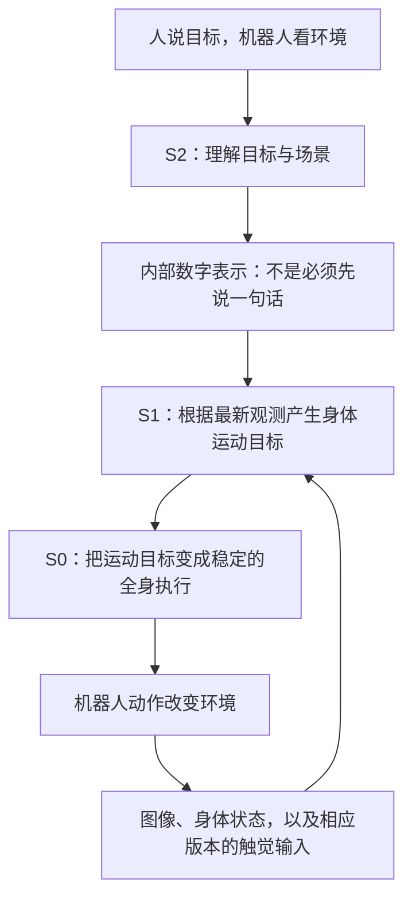

# 用大白话看 Figure：每一代到底变了什么？

[首页](../../README.md) · [Figure 入口](README.md) · [Index 数据管线](05_index_pipeline.md) · [三家公司做过哪些任务](../SCENARIOS_BY_MODEL.md)

核对日期：2026-09-20。**先记住：听懂并动手 → 做得更连续 → 手脚配合 → 换个家也能做。** 这是学习主线，不是说每次发布只改了一件事。

## 1. 先把三个名字分开

| 名字 | 大白话 | 别混成什么 |
|---|---|---|
| Figure 02、Figure 03 | 机器人身体的型号 | 不等于 Helix 02、Helix 2.5 的模型版本 |
| Helix、Helix 02、Helix 2.5 | 控制机器人的模型/系统 | 模型升级不必与身体换代一一对应 |
| Go-Big、Index | 获得人类行为经验的数据计划与管线 | 不是新一代动作模型，也不是公开可下载的完整数据集 |

例如，官方明确介绍 **Figure 03 身体搭配 Helix 02** 在 BMW 进行物流流程演示。[官方案例](https://www.figure.ai/news/f-03-at-bmw)

## 2. 按时间看：不是只有三个发布节点

| 时间 / 工作 | 当时主要卡在哪里 | 增加或改变什么 | 用一句话记住 | 原始依据 |
|---|---|---|---|---|
| 2025-02，**初代 Helix** | 看懂语言和图片，不代表能及时控制手和身体 | S2 负责理解；S1 根据其内部表示和新观测快速生成上半身动作 | **把“知道要拿什么”接到“手怎样去拿”** | [初代说明](https://www.figure.ai/news/helix) |
| 2025-06，**物流更新**，未另起正式代号 | 翻包裹找标签时容易重复查看，软包装和接触变化难处理 | 增加视觉记忆、状态历史、力反馈，并扩充示范数据 | **记得刚才看过哪一面，也感知有没有碰到东西** | [物流更新](https://www.figure.ai/news/scaling-helix-logistics) |
| 2025-09，**Go-Big / 导航迁移** | 机器人逐场景采集数据难扩展 | 尝试从人类第一视角视频学习语言引导的导航 | **先向人学“去哪里、怎么绕过去”** | [Go-Big](https://www.figure.ai/news/project-go-big) |
| 2026-01，**Helix 02** | 手会操作，走路、伸手、重心变化仍须协调 | 扩展至全身动作；加入 S0，结合掌部相机、指尖触觉等输入 | **把手、脚、躯干变成一套能配合的系统** | [02 说明](https://www.figure.ai/news/helix-02) |
| 2026-08，**Index** | 人类视频规模变大后，质量、重复和分布失衡也变严重 | 将采集与筛选、审核、去重、再平衡、标注接成数据管线 | **把大量生活录像整理成可学习的经验** | [管线详解](05_index_pipeline.md) |
| 2026-09，**Helix 2.5** | 在采集过的地方会做，换个家庭未必会 | 从随机初始化进行 Index 预训练，再做行为适配，检验陌生家庭泛化 | **学过这类家务后，换房间和物品还会不会做？** | [2.5 说明](https://www.figure.ai/news/helix-2-5-zero-shot-30-home-generalization) |

2026-05 的双机器人卧室整理，是 **Helix 02 的能力扩展演示**；官方说明核心算法未变，通过新增数据扩展行为。不要再给它编一个“Helix 新一代”的编号。[卧室整理说明](https://www.figure.ai/news/helix-02-bedroom-tidy)

## 3. S2、S1、S0 分别干什么？

把目标想成“把杯子送到柜子里”。下面是**教学类比**，不是官方给三个模块逐句下达的指令。

**初代重点是 S2＋S1；02 明确加入 S0，并让动作范围扩展到全身。** 图中展示的是 02 的分工。它帮助你理解“想做什么”“身体怎样动”“怎样稳当地执行”三个层次，不能直接当作 2.5 全部内部实现图。[02 架构说明](https://www.figure.ai/news/helix-02)

两个容易误会的地方：

- S2 到 S1 传的是内部数字表示（latent），不要求是可读的中文或英文。
- 初代没有公开这套 S0，不等于当时机器人完全没有底层控制或平衡系统。

## 4. 三代模型的数据，变化在哪里？

| 模型 | 公开信息能够确认的学习方式 | 应该怎样理解 |
|---|---|---|
| 初代 Helix | 利用已有 VLM，再结合约 500 小时机器人遥操作；S2 与 S1 联合训练 | 先有看图和语言基础，再学机器人怎么动。500 小时不包含 VLM 原有全部预训练数据。[来源](https://www.figure.ai/news/helix) |
| Helix 02 | S0 使用重定向人类运动及仿真强化学习；S1/S2 的完整训练配方未公开 | 人的运动经过处理，用来教底层身体协调；不能把 S0 的训练方式套给整个模型。[来源](https://www.figure.ai/news/helix-02) |
| Helix 2.5 | 官方披露从随机初始化、仅用 Index 做这一轮预训练，之后进行任务适配 | 人类经验先提供广泛基础，具体机器人行为仍有适配阶段；不能理解成“看完视频就不需要机器人数据”。[来源](https://www.figure.ai/news/helix-2-5-zero-shot-30-home-generalization) |

**重定向**可以先理解为：把人的身体运动，转换成机器人身体可以参考的运动。人的关节和机器人的关节不完全相同，因此不是直接复制一串关节角。这里是概念解释，不代表已知 Figure 的具体转换算法。

## 5. 每一代的证据，回答的是不同问题

| 你要验证什么 | 代表性证据 | 能带走的结论边界 |
|---|---|---|
| 是否能把语言落到操作 | 初代协作收纳食品、新物体抓取演示 | 展示语义与上半身操作结合；不等于随便一个家务都能完成。[来源](https://www.figure.ai/news/helix) |
| 数据和记忆是否改善熟练度 | 物流任务的受控对比 | 说明针对包裹处理的改进；条码朝向正确率不是全仓库自动化率。[来源](https://www.figure.ai/news/scaling-helix-logistics) |
| 身体是否能连续协作 | 02 的洗碗机操作与双机器人卧室整理 | 关注移动与操作结合；演示不能代替总体可靠性统计。[02](https://www.figure.ai/news/helix-02) · [卧室](https://www.figure.ai/news/helix-02-bedroom-tidy) |
| 换地方后是否还能做 | 2.5 的陌生家庭测试 | “新家庭/新物体”与“从未训练过的任务”要分开。具体任务与测试条件见[场景清单](../SCENARIOS_BY_MODEL.md#figure-home)。 |

## 6. 还不能从公开材料确定什么？

2.5 的完整网络层次、动作输出损失、各组件频率，以及与 02 的逐模块改动，尚不足以从该发布页完整重建。**不能自动沿用初代的 7B/80M，或 02 的所有控制参数。**

阅读新版本时，只需继续问三件事：**它多了什么输入或训练经验？输出负责的身体范围变了吗？实验真正换了什么测试条件？** 这比只记版本号更有用。

下一步：[Index 如何处理数据](05_index_pipeline.md) → [工业与家庭任务清单](../SCENARIOS_BY_MODEL.md)。
