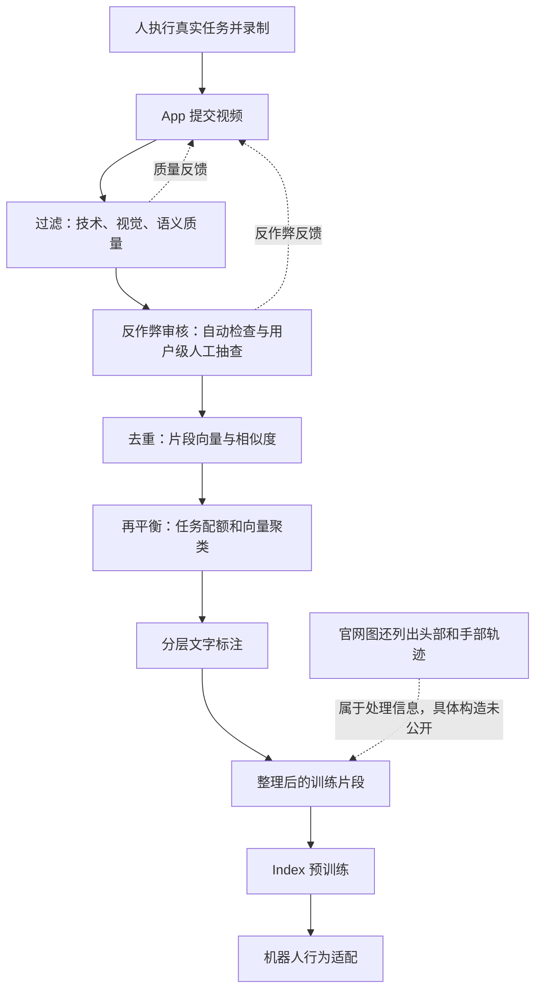

# Index 数据管线：官方披露了什么，每一步怎样理解？

[首页](../../README.md) · [Figure 白话迭代](04_evolution_plain_language.md) · [Figure 入口](README.md)

核对日期：2026-09-20。**先记一句：Index 处理的是“人做事的经验”，不是上传一段视频就自动得到一条机器人关节动作。** 本页将官方事实、教学例子和未公开细节分开。

## 1. 先看两份官方证据

主要依据是 2026-08-25 的 [Index 发布正文](https://www.figure.ai/news/introducing-index)及其 [官方流程图](https://images.ctfassets.net/qx5k8y1u9drj/7j7o3e4ksDkElElsyZ0nWb/69df9adda96b39e04590cd642c043725/pipeline_diagram_whiteink__1_.png)。图中白色文字适合在深色背景下查看。

**官方披露摘要：** 正文列出过滤、反作弊审核、去重、再平衡、标注五步。自动检查技术、视觉、语义质量；人工按用户抽查异常行为；片段用向量表示比较相似度；任务配额与向量聚类共同平衡数据；episode 配有分层文字描述。图中另列出头部/手部轨迹、自动与人工反作弊，以及反馈到采集 App 的环路。[来源](https://www.figure.ai/news/introducing-index)

### 正文与图示有两处不能强行合并

| 核对点 | 正文与图示分别怎么表达 | 本页怎样处理 |
|---|---|---|
| 标注发生的位置 | 正文最后说分层文字标注；图的前部已将过滤与标注放在一起 | 标注可能涉及不同阶段，但实际先后依赖、是否反复运行未公开，不能编成固定的“两次标注” |
| 去重的范围 | 正文提到与已接收数据比相似度；图强调每位贡献者内部的新颖性 | 至少存在贡献者维度的要求；不能据此断言已实现完整的全球跨用户去重 |

图中出现头部和手部轨迹，**不代表公开了它们是二维还是三维、绝对还是相对坐标，也不代表已经转换成机器人关节指令。**

## 2. 先按功能理解完整流程

下面是本页重画的**功能关系图**。实线沿正文五步组织；虚线补充官网图里的反馈。它不声称还原内部服务的真实执行顺序。

末尾“预训练 → 行为适配”来自 [Helix 2.5 的训练说明](https://www.figure.ai/news/helix-2-5-zero-shot-30-home-generalization)，不属于 Index 正文五步本身。

## 3. 用“录一段叠毛巾”理解五步

**以下例子、样本编号和检查方式都是教学示意；不是 Figure 的真实阈值、内部规则或标签格式。** 官方明确的动作已在第 1 节列出，下面解释这些动作为什么有用。

### 第一步：过滤——这段记录能不能用？

可以把三类质量理解成三个问题：

| 质量类别 | 教学例子 | 它关心什么 |
|---|---|---|
| 技术质量 | 视频文件打不开、中间记录缺失 | 数据是否能被正常读取和处理 |
| 视觉质量 | 手和毛巾一直在画面外、画面看不清 | 是否看得到完成任务所需的信息 |
| 语义质量 | 选了“叠毛巾”，视频却一直在拍空桌子 | 内容是否提供了所需的行为经验 |

不是“画面清晰”就一定有用；也不是“动作做失败”就一定是坏数据。记录质量与行为质量是两件事。**Index 是否保留真实失败、如何标记失败，官方这里没有说明。**

需要继续核实：具体检测器、阈值、是否允许部分片段保留、误剔除率，以及不同任务是否使用不同规则。

### 第二步：反作弊审核——是真实贡献，还是在绕过要求？

过滤主要看记录能否用于学习；反作弊还要判断贡献行为是否可信。假设同一个人反复提交同一段视频：单个文件可能清晰完整，但不能按多次全新经验理解。

用户级抽查的价值，是能把一个人的多次提交联系起来看，而不只逐条判断视频。**它不等于所有视频都由人工全量观看，也不能据此计算人工审核成本。**

需要继续核实：人工如何抽样、自动模型怎样报警、误判如何复核、是否存在账号级处置；这些实现没有在发布页展开。

### 第三步：去重——有没有带来新的经验？

**Embedding（向量表示）**可以先理解为一串“描述片段内容的数字”。模型把片段转成数字，再比较数字是否接近，比只检查文件是否完全相同更有机会识别近似内容。

但“数字相近”不自动等于“训练价值一样”。例如：

- 同一段叠毛巾视频换个文件名：几乎没有新信息。
- 另一家庭、不同台面、不同毛巾：虽然任务相同，可能有新的场景信息。
- 同一场景中，先失败再换抓法：可能是有价值的策略变化。

这说明去重阈值是在“减少冗余”与“保留有用变化”之间作取舍。**编码器、片段长度、相似度公式和阈值均未公开；不要直接填成某一种模型或余弦相似度。**

### 第四步：再平衡——别让最容易采的任务占满训练集

假想收到了很多叠毛巾视频、很少擦桌子视频。即便全部真实而且互不重复，训练也可能过度偏向叠毛巾。

任务标签帮助回答“是哪一类工作”；向量聚类则可能帮助发现同一标签内的不同内容。**聚类**就是按表示的相近程度把片段分组；这些组不一定恰好对应人事先写好的任务名称。

教学上可以这样理解：先看“叠毛巾是不是太多”，再看“这些叠毛巾是否又集中于相似桌面、物品或拍摄方式”。后一句只是解释聚类的潜在作用，不是官方公开的精确聚类维度。

需要继续核实：配额单位是视频数、小时还是训练采样量？不足类别怎样补采？调低权重与删除片段怎样选择？正文不能完整回答这些问题。

### 第五步：分层文字标注——把“看到了什么”变成“在做什么”

一段视频可以用不同粒度描述。下面是**自行构造的教学标签**，官方没有给出这套层数或格式：

| 粒度示意 | 教学标签 |
|---|---|
| 整段目标 | 把毛巾叠好并放到一旁 |
| 阶段 | 摊开毛巾 → 对齐 → 折叠 → 放到叠放区 |
| 局部动作 | 抓住毛巾两角；拉齐一侧边缘 |

这样可以帮助模型把不同长短的行为与语言联系起来。它仍然没有直接告诉机器人“第几个电机应转多少度”。

需要继续核实：文字由什么模型或人员生成、是否带时间边界、有没有人工复核、出错如何修正。官网图写有文字描述，不等于这些生成与审核细节已经公开。

## 4. 六条假视频，怎样走过管线？

这是**假想处理演练**，用来区分五步职责，不能当作 Index 的真实判定结果。

| 假想提交 | 首先关注哪里 | 为什么 |
|---|---|---|
| A：完整清楚地叠一条毛巾 | 进入质量检查，再继续处理 | 清晰是起点，还要看真实性、重复程度与数据配比 |
| B：把 A 换文件名再次提交 | 去重；如有规避行为，再涉及反作弊 | 重复内容与故意作弊相关，但概念并不相同 |
| C：全程黑屏 | 技术/视觉质量 | 几乎看不到行为 |
| D：选择叠毛巾，却录了看书 | 语义与任务匹配 | 任务选择和实际内容不一致 |
| E：陌生家庭里用不同方法叠毛巾 | 判断是否保留有用差异 | 相同任务也可能带来新的场景或策略 |
| F：真实擦桌子片段 | 再平衡时判断其代表性 | 稀缺类别可能有用，但具体采样规则仍未知 |

## 5. 最后得到的数据里，哪些字段能确认？

| 信息 | 公开证据状态 | 初学者应怎样理解 |
|---|---|---|
| 人类任务视频/片段、任务相关信息 | 明确出现 | 观察人怎样做事 |
| 分层文字描述 | 正文明确 | 用语言描述片段内容与行为 |
| 头部、手部轨迹 | 官方流程图明确列出 | 有运动跟踪相关信息；具体定义未给出 |
| 三维标定、深度、相机参数、统一坐标系 | 该说明未充分披露 | 不能自行假设每段视频都有这些字段 |
| 机器人关节状态、连续动作标签 | 不能由 Index 视频本身推定存在 | 人的身体记录不是机器人的控制指令 |
| 失败/奖励/接触力标签、整段数据字段规范 | 未充分披露 | 不把其他公司的训练需求写成 Index 已提供字段 |

Index 的 [官方 App 页](https://www.figure.ai/index-app)介绍了贡献者录制和服务网络；这里没有给出足以复刻采集设备与传感器标定的完整规格。

## 6. 怎样接到 Helix 2.5？

官方把 Index 用于广泛预训练，再使用任务数据适配机器人行为。在保持下游条件一致的对照中，公开报告完整任务成功率 **9% → 56%**。这提供了人类经验有助于迁移的证据；具体预训练预测目标、人的轨迹怎样对应机器人动作、哪些组件如何更新，仍未完整公开。[Helix 2.5 对照说明](https://www.figure.ai/news/helix-2-5-zero-shot-30-home-generalization)

所以这里应理解为：**人类视频先提供可迁移的知识，机器人还要学会用自己的身体执行。** 不能据此认定 Index 已自动生成所有机器人关节标签，也不能把 S0 使用的人类运动训练数据直接等同于 Index 全部视频。

与 PI 对照时，可回看 [action expert 的数据需要什么](../../openpi_study/07_FLOW_MATCHING_FROM_ZERO.md)：机器人动作训练里的观测—动作配对，和“人类视频＋文字＋人体轨迹”的字段不能画等号。

## 7. 规模数字应该怎样读？

| 官方数字与时间 | 它说明什么 | 不能推出什么 |
|---|---|---|
| 2026-08-25：累计超过 1,600 万条上传视频，约每秒接收 30 分钟视频 | 采集与上传规模 | 全部通过质量检查、全部用于训练 |
| 2026-09-17：约每秒新增 35 分钟人类经验 | 较晚披露的持续数据产生速度 | Helix 2.5 实际使用的训练小时数 |

来源：[Index 发布](https://www.figure.ai/news/introducing-index) · [Helix 2.5 发布](https://www.figure.ai/news/helix-2-5-zero-shot-30-home-generalization)。累计量、持续速率和最终入训量是三种不同口径。

## 8. 后续向 Figure 专家最值得核实的六件事

1. 头部和手部轨迹具体是什么坐标与维度？是否有可靠性分数？
2. 去重只在贡献者内部做，还是也跨用户？怎样避免删掉有价值的策略变化？
3. 原始上传、通过质量审核、最终入训分别有多少？分母按视频数还是时长？
4. 分层文字、时间分段、动作轨迹分别怎样生成和抽查？人工主要花在哪里？
5. 再平衡改的是存储集合、采样权重，还是未来采集配额？依据什么指标调整？
6. 预训练到底让模型预测什么，如何接到机器人行为适配？哪些实验能区分视觉知识、任务语义和运动信息的贡献？

[Figure 每代变化](04_evolution_plain_language.md) · [工业与家庭任务清单](../SCENARIOS_BY_MODEL.md) · [返回 Figure](README.md)
