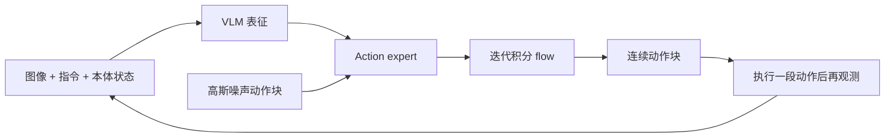

# π0：把 VLM 的语义表征接到连续动作生成

<!-- reading-nav-start -->
[首页](../../README.md) · [PI入口](README.md) · [按问题查找](../FIND_BY_QUESTION.md)
<!-- reading-nav-end -->

**阅读定位：已读论文的机制复盘。** [原论文](../papers/pi/pi0.pdf) · [arXiv](https://arxiv.org/abs/2410.24164)。以下事实依据原文 Sections III–V、Figure 3 与实验部分；分析与建议另行标注。

## 问题和贡献

预训练 VLM 会理解图像和语言，但机器人需要高维、连续、具有多种合理解的动作序列。π0 用预训练 VLM 加较小 action expert，以 flow matching 学习动作块分布。关键是把语义迁移、动作生成和大规模多本体数据训练放在同一个框架里。

## 训练 workflow

多本体示范与公开机器人数据 → 对齐相机、语言、本体状态和动作 → 从 PaliGemma 初始化 VLM → action expert 接受带噪动作与 flow 时间 → 预测向量场 → 大规模预训练 → 用选定任务的高质量数据后训练。

主干和 action expert 通过注意力交互，不能把 expert 理解为在最终语言输出后简单接一个回归层。这里也不应提前套用后来 KI 的 stop-gradient 配方。

## 运行 workflow

为便于理解，使用“从噪声走向数据”的等价记号：

$$
A_s=(1-s)\epsilon+sA,\qquad
L_{FM}=\mathbb E\|v_\theta(A_s,s,o,\ell)-(A-\epsilon)\|^2.
$$

这是本库统一的符号，原论文的向量场方向/时间约定应与其采样公式一起读。它预测的是动作空间中的运输方向；不是预测真实物体的速度场。一个动作块有多个未来控制时刻，不能把动作执行频率当作完整 VLM 前向频率。

## 证据怎么读

- 先看 Figure 3 与模型章节：哪个 token 使用哪套权重、状态从哪里进入、哪些 token 彼此可见。
- 再看预训练/后训练对照：泛化初始化的价值与专项后训练的收益分开。
- 灵巧任务和长演示说明行为能力，但要回查每个任务的训练数据与测试设置，不能把全部演示都称作未见任务 zero-shot。

## 局限与下一步

原始 π0 不是完整的长期记忆或在线 RL 系统。你下一轮重读最值得问的是：**连续动作头学得好，是否意味着 VLM 的语义能力保留得好？** 这个问题直接连接 [FAST](02_fast.md) 与 [KI](04_knowledge_insulation.md)。

**本库实验建议：** 固定模型与数据，分析动作块长度和执行前缀长度对闭环反应的影响；同时记录延迟，不能只报告离线动作误差。

<!-- reading-footer-start -->
[接着读：π0.5](03_pi05.md) · [返回PI入口](README.md)
<!-- reading-footer-end -->
