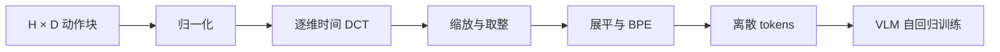

# FAST：动作表示决定 VLA 学起来是否高效

<!-- reading-nav-start -->
[首页](../../README.md) · [PI入口](README.md) · [按问题查找](../FIND_BY_QUESTION.md)
<!-- reading-nav-end -->

**阅读优先级：高。** [原论文](../papers/pi/fast.pdf) · [arXiv](https://arxiv.org/abs/2501.09747) · [官方 tokenizer](https://huggingface.co/physical-intelligence/fast)。依据 Sections IV–VI、Figure 4、Algorithm 1。

## 核心问题

高频控制中相邻动作高度相关。逐时间、逐维分箱会形成很长且重复的序列；next-token loss 可以靠局部重复变小，却未必学到任务级行为。FAST 在时间维度压缩整段动作，改变自回归模型面对的学习问题。

## Tokenizer workflow

1. 用训练数据每维的分位数统计做动作归一化，原文以 1%/99% 分位数映射到约 [-1,1]。
2. 对每个动作维度沿时间轴做 DCT，把平滑时序变为较稀疏的频率系数。
3. 系数缩放并取整，控制重建精度与稀疏程度。
4. 按规定顺序展平系数矩阵，再用 BPE 压缩符号序列。
5. 推理时 AR 预测压缩 token；BPE 解码、反量化、逆 DCT、反归一化得到动作块。

**DCT 本身是可逆变换；量化引入损失；BPE 压缩在符号层面无损。** 不能把误差全部归因于 BPE，也不能把 FAST 说成一个用神经网络训练的动作 VQ 自编码器。

## 模型训练与推理

VLM 学习图像/语言条件下动作 token 的交叉熵目标。FAST+ 是跨动作空间和控制频率的通用 tokenizer；FAST tokenizer 与 π0-FAST policy 是不同对象。π0-FAST 的动作生成是自回归解码，不能因名称带 π0 就认为它依然通过 flow expert 输出动作。

## 证据与边界

论文报告在高频灵巧任务中改善学习效果，并在其大规模设置中把训练时间降低最多约 5 倍。这是特定比较下的训练结果，不能转换成“机器人执行快 5 倍”。判断效果应同时看 token 数、动作重建误差、训练曲线、推理延迟和闭环成功率。

重点读 Section IV 的失败案例，再读 Figure 4 和算法。若只看最终成功率，会错过“为什么朴素 tokenization 的 loss 有误导性”这个核心动机。

## 与后续工作的联系

[π0.5](03_pi05.md) 与 [KI](04_knowledge_insulation.md) 利用离散动作监督改善表征学习，再让连续 expert 承担部署动作输出。“离散训练监督”和“连续推理输出”可以共存。

**本库实验建议：** 扫量化尺度，画 token 数—重建误差—接触动作误差的曲线；不要只在平滑轨迹上检验压缩。

<!-- reading-footer-start -->
[前一篇：π0.5](03_pi05.md) · [接着读：KI](04_knowledge_insulation.md) · [返回PI入口](README.md)
<!-- reading-footer-end -->
