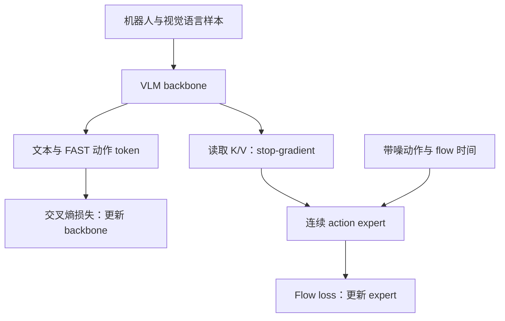

# Knowledge Insulation：把梯度路径当成设计对象

**阅读优先级：最高。** [原论文](../papers/pi/knowledge_insulation.pdf) · [arXiv](https://arxiv.org/abs/2505.23705)。重点依据 Section 5、Equations 4–6、Section 6 消融；本地 PDF 第 6 页核对了梯度公式。

## 核心问题

给预训练 VLM 接一个随机初始化的 continuous action expert，虽然可以生成快速连续动作，却可能扰乱 VLM 的学习动态和语义迁移。单纯冻结 VLM 又可能让表征无法适应控制任务。

## 训练 workflow

监督分工可以用下式理解：

$$
h=f_\theta(o,\ell),\quad
L_{CE}(\theta),\quad
L_{FM}(\phi;\operatorname{sg}(h)).
$$

这是帮助理解的简化图；原实现隔离发生在 backbone/expert 注意力交互中的 K/V 路径，需读 Equations 5–6。不是把整个主干输出存成固定离线特征。

两项关键约束：**action expert 的梯度不回到 backbone；离散 FAST token 和连续动作 token 不互相注意。** 后者避免利用另一种目标表示走捷径，前者改善训练动力学，两者不能只用“detach”一个词替代。

## 为什么仍然学得到控制知识

backbone 继续通过文本、视觉语言任务和 FAST 动作 token 的 CE 接受训练，因此其内部表征能包含控制信息。expert 读取这种表征，再学习快速连续输出。若去掉 backbone 的动作监督，只保留 stop-gradient，机制就改变了。

## 推理 workflow

部署时使用 backbone 的条件表征，由连续 expert 经少量 flow 步生成动作块；不必把完整 FAST 动作序列先自回归生成出来。文本预测仍可用于任务层级。

## Claim–evidence

| 主张 | 应读证据 | 必须保留的限制 |
|---|---|---|
| 梯度隔离影响训练/语言跟随 | joint-training 有/无 stop-gradient 的对照 | 不是所有架构上都证明隔离必然更优 |
| VLM co-training 有助于保留知识 | 有/无 VLM 数据消融 | 数据与梯度作用要分开 |
| 冻结 backbone 不是等价替代 | frozen baseline | 冻结会限制动作表征学习 |
| 可兼顾训练与运行效率 | 训练曲线和推理机制 | 训练步数、训练墙钟时间、运行延迟不是同一指标 |

## 你的精读练习

不看图重画 K/V、CE、flow 三条路径，并标明谁被更新。然后与 [Helix](../figure/01_helix.md) 对照：原始 Helix 明确让 S1 梯度经 latent 更新 S2。结构上都有大/小模块，不等于采用相同优化策略。

**本库实验建议：** 在同一数据、batch 和预算下比较联合训练、KI、冻结主干；同时测控制效果和语言指令冲突任务，不能只看训练 loss。
