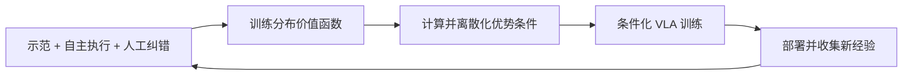

# π*0.6 / RECAP：怎样从部署经验改进 VLA

**阅读优先级：高。** [原论文](../papers/pi/pi06_star.pdf) · [arXiv](https://arxiv.org/abs/2511.14759)。重点依据 Sections III–V、Figures 1/3/4、Algorithm 1。

## 先区分三个名称

- **π0.6**：基础 VLA；原文说明它从 π0.5 演进，使用 Gemma 3 4B、扩大至 860M 的 action expert 和更新的数据。
- **RECAP**：RL with Experience and Corrections via Advantage-conditioned Policies，利用经验、纠错和优势条件训练策略的方法。
- **π*0.6**：将 RECAP 应用到 π0.6 所得到的策略家族/训练结果。星号不能省略后仍认为完全同义。

## 为什么不只做行为克隆

自主策略会进入示范不常覆盖的状态，且示范也包含慢速、失败和次优行为。只继续拟合平均示范，不能明确告诉模型哪些动作让任务取得更好进展。RECAP 用价值估计为动作提供“相对好坏”的条件。

## 训练闭环

这里的“分布价值函数”指 **distributional value function：预测回报分布**，不是指多台机器上的分布式计算。原文将经验回报分箱，通过分类监督训练价值模型；再从分布计算期望价值，估计动作优势，形成二值优势指示条件。

概念上是：

$$
V_\psi(o,\ell)\rightarrow \hat A(o,A,\ell)
\rightarrow I\in\{0,1\}\rightarrow \pi_\theta(A\mid o,\ell,I).
$$

推理偏向较优条件以提取改进策略。上式省略了原文阈值、指导和回报归一化细节，不是可直接替代 Algorithm 1 的实现。

## 与 PPO/筛选模仿的区别

论文说明 flow 模型的可处理 likelihood 给直接 policy-gradient 路线带来困难，转而以 advantage conditioning 保留监督式训练的便利。好坏经验都能进入训练，通过条件区别；不是只保留成功轨迹，也不是简单宣称给 VLA 接上 PPO。

## 运行与评估

策略依然输出动作块。价值模型主要为训练中的标签与改进服务，不应未经原文支持就画成每一个控制步都在线搜索的规划器。部署收集、奖励/纠错、重新训练构成迭代循环；不等于机器人每个动作之后立即更新整个 VLA。

精读时把 **成功率、吞吐量、任务耗时、人工接管量** 分开。比较专家示范、只用纠错、加入自主经验等设置，并检查收益是否只在专项任务上成立。

## 联系与研究问题

[π0.7](07_pi07.md) 会利用先前策略的经验数据与质量 metadata 蒸馏能力；[RLT](08_supporting_work.md) 则缩小在线更新模块。两者回答的成本问题不同。

**本库分析：** 可切入的研究问题是价值误差如何污染优势条件，以及人工纠错在何种状态最有信息量。实验需把新增交互量记入成本，不能只对比最终分数。
