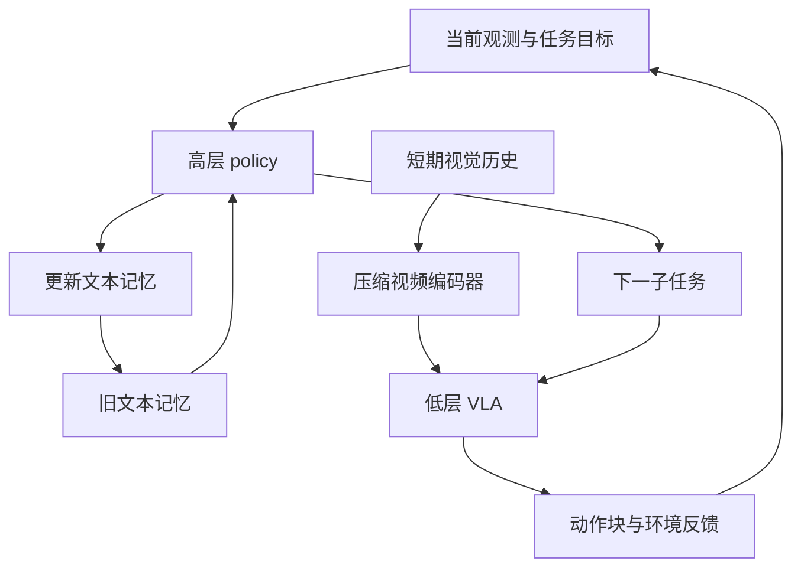

# MEM：短期视觉记忆与长期语义记忆

**阅读优先级：高。** [原论文](../papers/pi/mem.pdf) · [arXiv](https://arxiv.org/abs/2603.03596)。依据方法章节中的 factorization、Language Memory、Video Encoder 和实验消融。

**新增详细对照：** [π0.6 家族区别与数据要求](09_pi06_family.md)。MEM 的历史与记忆机制不等于 RECAP 的价值/优势学习；训练数据包含 rollout 和纠错，也不能单凭数据来源断定它使用完整 RECAP。

## 为什么只看当前画面不够

同样的画面可能对应不同任务状态：已经放过几勺、某个抽屉是否检查过、被手遮挡的物体刚才在哪里。把十几分钟视频直接放入控制模型，计算成本和信息密度都不合适。

## 两种记忆，各自存什么

| 类型 | 内容 | 用途 | 主要风险 |
|---|---|---|---|
| 短期视觉历史 | 最近动作、接触、遮挡、运动细节 | 低层操作与即时策略调整 | 压缩损失细节、时间采样不匹配 |
| 长期文本摘要 | 已完成步骤、数量、位置、仍相关的任务事件 | 高层决定下一子任务 | 摘要遗漏、把失败误记成成功 |

## 训练 workflow

利用带子任务注释和成功/失败信息的轨迹，让预训练语言模型生成相关事件摘要，形成旧记忆→新记忆的监督；训练高层 policy 预测子任务与更新后的文本状态。短期视频通过视觉编码器的时空压缩进入模型，避免 token 数随历史帧数直接线性增长。

“LLM 辅助生成记忆标签”是训练数据处理，与运行时每一步都调用外部 LLM 是两件事。

## 运行 workflow

**文本摘要压缩语义，视觉历史保留细节**。概念图将两条职责分开；具体条件输入应按原文公式和实现章节核对，不可把“高层不需要历史”理解成通用约束。

## 证据边界

论文报告需要最长约 15 分钟记忆的任务及上下文中的策略适应。读消融时分别比较缺少语言记忆和缺少视觉历史的失败，而不是只比较“有/无更多 token”。上下文适应是根据近期经验改变行为，不代表执行时更新模型权重。

正文和架构图可以支持“高低层功能分工”；仅凭图上两个方框不能自行推定训练时共享或不共享全部权重。若研究需要精确参数共享方式，应进一步按附录和实际代码核实。

## 你最值得追问的地方

**本库分析：** 长期记忆需要保留足以决定未来动作的信息，同时防止错误状态被不断重复。可以构造“当前画面相同、过去计数不同”的成对测试，并分别注入错误摘要和错误视觉历史，测模型能否恢复。只展示长视频不能排除模型仅依赖场景可见线索。

下一步把 MEM 与 [π0.7](07_pi07.md) 中视觉目标和异步更新的接口对照。
