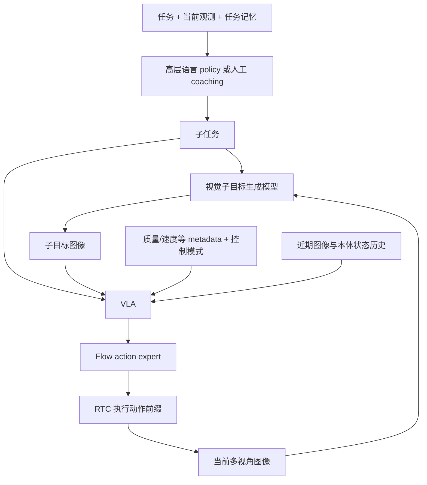

# π0.7：丰富上下文如何变成可引导的通用策略

<!-- reading-nav-start -->
[首页](../../README.md) · [PI入口](README.md) · [按问题查找](../FIND_BY_QUESTION.md)
<!-- reading-nav-end -->

**阅读定位：已精读后的系统整合。** [原论文](../papers/pi/pi07.pdf) · [arXiv](https://arxiv.org/abs/2604.15483) · [官方页面](https://www.pi.website/blog/pi07)。依据 Sections IV–VII、Figure 2/3、Algorithm 1；PDF 第 4、7 页核对结构与推理流程。

**新增零基础专题：** [世界模型与 action expert 的训练、数据和时间尺度区别](10_pi07_world_model_vs_action_expert.md)。两者都涉及 flow matching；前者生成图像潜变量，后者生成连续动作。世界模型的子任务末尾目标、VLA 的未来图条件采样和部署时约 4 秒刷新是不同规则。

## 贡献应拆成三层

1. **条件信息**：更详细的语言、episode metadata、控制模式和视觉子目标。
2. **训练数据**：跨本体示范、先前模型的自主执行与纠错、人体视频、非机器人任务；通过上下文区别行为质量。
3. **运行系统**：高层语言 policy、生成视觉目标的模型、短期历史、连续动作 expert 与异步 RTC。

因此“π0.7 = 更大的 π0”不是充分解释。

## 结构与训练

正文说明 VLM 从 Gemma 3 4B 初始化，action expert 为 860M，总 VLA 约 5B；采用 MEM 风格视频历史编码。Figure 2 另画有高层 policy 与 BAGEL 初始化的视觉子目标生成模型，不能把约 5B 的 VLA 参数量当成整个部署栈的参数总量。

训练时提供当前多视角观测、可选历史、子任务、可选未来图像/生成子目标与 metadata。对上下文组件做 dropout，学会在部分条件缺失时运行。future image 是训练监督/条件；部署使用生成子目标，不会访问真实未来画面。论文也混入生成图像以减小这两种条件的分布差异。

## 推理 workflow

原文运行设置：动作块 50 步，5 次 denoising，执行其中 15 或 25 步；在 50 Hz 控制下，块覆盖约 1 秒、执行前缀约 0.3 或 0.5 秒。**这些是论文设置，不是所有机器人必须采用的常数。**

子目标在语义子任务改变或距离上次生成约 4 秒时刷新；高层、视觉目标与 VLA 异步运行，低层使用最近可用条件。training-time RTC 模拟 0–12 步延迟，即 50 Hz 下最多 240 ms 的训练延迟范围；不要把它当作对任意网络延迟的保证。

## Metadata 不等于在线奖励

速度/质量/错误标签作为上下文，帮助从不同质量数据学习并在部署时选择期望模式。原文使用 episode length 相关标签，不能把示例里的 Speed 数字当作 m/s。推理时写“质量高、无错误”是条件选择，不意味着实际执行必然达到这种质量。

## 三类实验必须分开阅读

| 类别 | 原文想证明什么 | 常见误读 |
|---|---|---|
| 专项灵巧能力 | 通用模型可吸收专项经验 | 从而认定所有任务都超过所有专用模型 |
| 组合泛化与引导 | 已知能力能在新组合或提示下使用 | 把有 coaching 的结果写成无人指导 zero-shot |
| 跨本体迁移 | 新的技能—本体组合可迁移 | 把完全未知的硬件/传感器接口也视为可直接运行 |

对每张结果图记录：是否用子目标图，是否有人提供子任务，是否训练过高层 policy，是否执行专项后训练。正文给出的 air-fryer coaching 与之后高层适配流程，不应合并成一个“只说一句话就完全学会”的结论。

## 复现和研究切口

本次核对的 openpi README 未列出 π0.7 checkpoint；不能把 π0.5 的公开实现标为 π0.7 复现。

**本库建议：** 你已读过此文，下一轮应把各个上下文通道逐项拿掉，思考“性能收益来自什么信息”。另一个切口是 stale subgoal：低层拿到滞后的视觉目标时，什么时候该忽略它，什么时候必须重新规划？

<!-- reading-footer-start -->
[前一篇：MEM](06_mem.md) · [接着读：世界模型与动作expert](10_pi07_world_model_vs_action_expert.md) · [返回PI入口](README.md)
<!-- reading-footer-end -->
