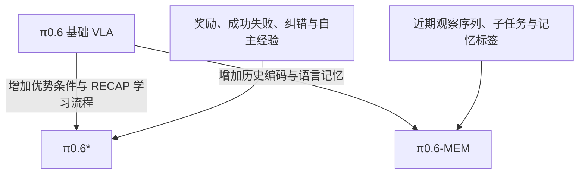
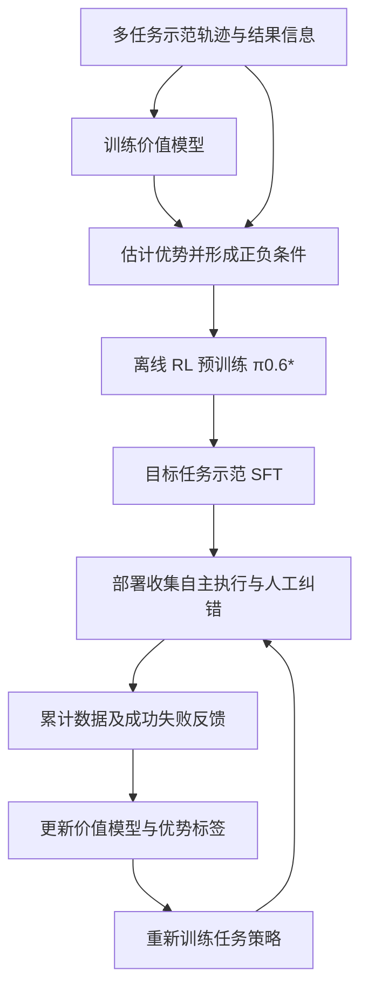

# π0.6、π0.6*、π0.6-MEM：分别改变了什么？

核对日期：2026-09-19。本文中的 **π0.6* 对应论文正式写法 π*0.6**。以下把名称统一写成 π0.6*，不把星号省掉。

**核心大纲：** 先区分模型、学习方法、记忆机制 → 比较结构 → 拆解训练数据 → 看运行时行为 → 判断实验能证明什么。

**先记住三句话：** π0.6 是基础 VLA；π0.6* 是用 RECAP 学习经验、奖励和纠错的模型；π0.6-MEM 是把短期视觉历史和长期语言记忆加入 π0.6 的模型。三者都可以用连续 action expert 生成动作，区别不在于谁“第一次使用 flow matching”。

## 1. 一张表分清三个名字

| 问题 | π0.6 | π0.6* / RECAP | π0.6-MEM |
|---|---|---|---|
| 最关心什么 | 从广泛数据学到更强的通用操作能力 | 从成功、失败与纠错中学会更可靠、更高效的动作 | 利用过去的信息解决当前画面无法判断的问题 |
| 相对 π0.6 的关键变化 | 本列是基座 | 增加优势条件及价值学习、经验收集循环 | 增加视频历史编码、状态历史和语言记忆更新 |
| 核心学习信号 | 动作、语言及其他监督目标 | 除原目标外，需要结果反馈；价值模型产生优势条件 | 除动作监督外，需要历史序列、子任务及记忆更新监督 |
| 低层主要输入 | 当前相机、本体状态、指令及可选 metadata | 同类输入，加期望的优势条件 | 近期图像与状态序列、当前子任务/任务 |
| 低层输出 | 连续动作块 | 连续动作块 | 连续动作块 |
| 新增的其他输出/模型 | 已保留高层子任务预测能力 | 训练时另有价值模型，评估进展与动作相对好坏 | 高层输出下一子任务和更新后的语言记忆 |
| 部署时改变什么 | 按当前条件执行 | 选择较优优势条件来采样动作 | 维护观察历史和语言记忆，再据此决策 |
| 不应从名称推断什么 | “基础模型完全不会高层规划” | “每动一下都在线反传、更新权重” | “已经完整采用 RECAP”或“只是给提示词多塞几张图” |

依据：π0.6 [Model Card §§1–3](https://website.pi-asset.com/pi06star/PI06_model_card.pdf)；[RECAP §§IV–V](../papers/pi/pi06_star.pdf#page=4)；[MEM §III](../papers/pi/mem.pdf#page=3)。

这表示两种不同方向的扩展。不能根据名字画成“π0.6 → π0.6* → π0.6-MEM”的单线升级，更不能把 MEM 的收益直接归因于 RL。**训练方法与记忆机制原则上可以组合，但论文名称本身不证明某个 checkpoint 已采用全部组合。**

## 2. π0.6：先把基础 VLA 说清楚

### 2.1 要解决的问题

在 π0.5 的高层子任务预测、低层动作生成基础上，改善模型的操作能力和不经专项微调的表现。它仍然是“观察环境和指令 → 产生动作”的策略，而不是只会输出文本的聊天模型。

### 2.2 方法：两个动作监督通道

根据 [RECAP §V-A](../papers/pi/pi06_star.pdf#page=6)，π0.6 使用 Gemma 3 4B 初始化视觉语言主干，连续 action expert 为 860M 参数，并采用 Knowledge Insulation（KI）：

| 训练分支 | 学什么 | 监督从哪里来 |
|---|---|---|
| 主干的离散输出 | 子任务文本、FAST 动作 token、图文任务等 | 语言标注、同一动作轨迹的离散编码、图文数据 |
| 连续 action expert | 当前条件下怎样生成连续动作块 | 真实动作块与随机噪声构成的 flow matching 训练对 |

FAST 动作 token 和连续动作块可以来自**同一段机器人动作的不同表示**。连续 action expert 不需要先等待 FAST 把动作逐 token 生成完；两种动作分支独立预测。KI 会阻止 action expert 的动作损失梯度传回 VLM 主干；主干仍由自身的离散监督等目标训练，不能理解成“主干永久冻结”。

### 2.3 数据与实验边界

Model Card 描述跨本体机器人数据、家庭中的移动/固定平台任务、高层子任务监督以及图文共训，未提供完整数据清单和混合比例。它的主要对比是 **π0.6 与采用 KI 的 π0.5 在不做任务专项微调时的表现**，这不是与论文最初任意一个 π0.5 版本做完全相同的对照。

所以读结果时要记下：基线版本、是否后训练、任务是否见过、衡量成功率还是任务进度/吞吐量。[来源：Model Card §§3–4](https://website.pi-asset.com/pi06star/PI06_model_card.pdf#page=2)。

## 3. π0.6*：怎样把“经历过”变成“学得更好”

### 3.1 先分清三种标签

| 名称 | 小白理解 | 如何获得 |
|---|---|---|
| 奖励 reward | 这次执行最终成功了吗、用了多久 | 任务成功/失败标注与时间步构造 |
| 价值 value | 从这个状态出发，按数据中的行为继续，预期还有多少进展/代价 | 价值模型从带结果的轨迹学习 |
| 优势 advantage | 这次动作相对该状态下的参考行为，是否带来更好的结果 | 结合奖励、前后状态的价值等估计 |

**成功轨迹不等于每个动作都有高优势，失败轨迹也不等于其中每个动作都无用。** 优势是在相应状态与参考行为下的比较，不能直接把整条轨迹的成功标签复制成所有动作的优势标签。

### 3.2 两个模型、两类损失

1. **价值模型**读观察和任务，预测回报分布。论文把实际轨迹回报离散成 201 个区间，用分类交叉熵训练，再从分布得到期望价值。
2. **策略模型**读观察、指令和优势条件，学习动作。离散动作仍用相应监督，连续 action expert 仍用 flow matching。

价值模型输出的分数不是机器人关节命令，优势条件也不是 flow matching 的噪声时间。它们分别回答“什么行为值得学”和“怎样生成连续动作”。[来源：RECAP §IV-A/B、§V-B/C](../papers/pi/pi06_star.pdf#page=4)。

### 3.3 完整 workflow 包含离线 RL 预训练

因此 π0.6* **不只指最后一次专项 RL 微调后的模型**。论文分别评估离线 RL 预训练、目标任务 SFT，以及加入自主经验后的阶段。具体实现中，每轮任务训练从预训练 checkpoint 出发，使用累积数据；不要自行改写成“永远接着上一轮参数训练”。[来源：RECAP Algorithm 1、§V-D](../papers/pi/pi06_star.pdf#page=6)。

### 3.4 具体要补哪些数据？

在相机、state、action、指令之外，至少还要能恢复：

- **完整 episode 与顺序**：知道动作之后发生了什么，何时结束。
- **任务结果**：成功或失败，及任务长度。论文用普通步的时间代价和失败终止惩罚构造奖励，再按任务归一化回报；不要求人为给每帧打一个精细分数。
- **行为来源和接管位置**：标明示范、自主执行、人类纠错。论文把纠错动作的优势指示设为正；这是训练约定，不是“人类永远正确”的事实保证。
- **训练产生的派生标签**：回报、价值估计和二值优势条件。这些不全是遥操作时人工标出来的。

负面经验也可进入数据，通过条件区分。它既不是“只留下成功录像”，也不是把奖励当作一条额外的关节数据。[来源：RECAP §§IV-B、V-C/D](../papers/pi/pi06_star.pdf#page=5)。

### 3.5 实验如何读

核心实验是咖啡、叠衣和纸箱组装，比较不同训练阶段的成功率与每小时成功次数。部分困难任务的吞吐量提升超过两倍；要保留任务及基线范围，不能改成“所有机器人能力翻倍”。这些专项经验学习结果也不能自动证明所有旧技能都保留。[来源：RECAP §VI、Figures 7–8](../papers/pi/pi06_star.pdf#page=8)。

## 4. π0.6-MEM：学会记住哪些过去信息

### 4.1 两种记忆不能合并成一个“长上下文”

| 记忆 | 输入/状态 | 教机器人什么 | 训练监督 |
|---|---|---|---|
| 短期视觉与本体历史 | 最近多帧图片、关节等 state 序列 | 遮挡前在哪里、刚才怎么失败、运动趋势是什么 | 以历史为条件预测后续动作；共训还包括视频语言任务 |
| 长期语言记忆 | 对已发生事件的精简文字摘要 | 做过几次、找过哪里、还欠哪一步 | 高层输出下一子任务及更新后的摘要 |

低层仍生成动作块。高层维护文字状态，例如“已经放入两个杯子，左柜检查过”，避免反复重复一个已完成步骤。摘要是事件状态，不需要理解成模型必须展示完整思维过程。[来源：MEM §III-A/B](../papers/pi/mem.pdf#page=3)。

### 4.2 不是直接拼接十几分钟原始视频

MEM 在视觉编码器内混合空间注意力和因果时间注意力，再压缩历史表征。方法本身不为视频编码器增加新的可学习参数，但**仍需用视频/轨迹数据训练原有参数**；“不新增参数”不等于“不需要训练”。

π0.6-MEM 把历史本体状态线性投影成 token，避免把每一帧 state 都转成长串文字。论文预训练采用六次观察（五次历史加当前），间隔 1 秒；后训练实验扩展到最多 18 帧、约 54 秒观察记忆。最长约 15 分钟的任务记忆依赖两种机制协作，不能等同于输入 15 分钟密集视频。[来源：MEM §III-C/D](../papers/pi/mem.pdf#page=4)。

### 4.3 数据怎样构造？

低层样本从一条连续轨迹中截取“过去观察序列 → 接下来动作块”，保留时间顺序及当前任务。高层样本则需“旧记忆 + 当下观察/任务 → 新子任务 + 新记忆”。

论文用带子任务语言标注和成功/失败信息的 episode，让现成 LLM 离线产生相关事件摘要，作为记忆更新标签。模型学会更新后，部署时维护的是自己的预测记忆；不能说每步都必须调用那一个外部标注 LLM。

预训练混合示范、自主 rollout、人类纠错、图文和视频语言数据。**数据里出现 rollout 与纠错，不足以推出采用了 RECAP 的价值模型、优势条件和全部 RL 流程。** 是否属于 RECAP，要核对学习目标和训练循环。[来源：MEM §III-B/D](../papers/pi/mem.pdf#page=3)。

### 4.4 实验与运行边界

看长任务、计数、遮挡及失败后换策略，并分别读缺少语言记忆、缺少视觉历史的消融。机器人看过失败后换一种方式，可能只是固定权重根据不同历史给出不同动作，叫作上下文适应；这与 RECAP 在数据收集后重新训练参数是两件事。[来源：MEM §IV](../papers/pi/mem.pdf#page=5)。

## 5. 用“把三个杯子放进柜子”串起来

以下是教学例子，不是论文新增实验。

| 遇到的困难 | 哪种机制主要回应 | 数据中要多保留什么 |
|---|---|---|
| 看见杯子，但不会稳定抓起放入 | 基础 VLA 与 action expert | 图像、state、指令、连续动作示范 |
| 能做但很慢，经常失败，希望从自主执行改进 | RECAP / π0.6* | 成败、耗时、完整轨迹、纠错位置，进而得到价值/优势标签 |
| 忘记已经放了两个，又重复取杯 | MEM 长期语言记忆 | 已完成步骤、数量等事件摘要及更新监督 |
| 夹爪遮住杯子，分不清刚才有没有抓稳 | MEM 短期观察历史 | 同步的近期视觉和本体状态序列 |

这些能力可以同时重要，但需要分别定位失败原因，而不是看到失败就一律加 RL 或一律加记忆。

## 6. 与 π0.7、openpi 学习范围的关系

π0.7 使用 MEM 风格的历史编码，并通过包括先前策略 rollout 在内的混合数据及质量 metadata 吸收能力；“用了 RL 训练策略的数据”不等于“π0.7 整体沿用 RECAP 目标”。它还可接收世界模型生成的未来子目标图像，这与 MEM 保存过去信息不同。

本仓库注释的 openpi 仍只作为 **π0 / π0.5** 代码教材，不能把这些概念笔记当成 π0.6*、MEM 或 π0.7 的公开实现。[进一步比较世界模型](10_pi07_world_model_vs_action_expert.md) · [从零理解 action expert](../../openpi_study/07_FLOW_MATCHING_FROM_ZERO.md)。

**自测：** 只加过去五张图，就等于 RECAP 吗？不等于。只记录成功/失败，就自动有长期记忆吗？也不等于。分别检查模型输入、标签、损失和参数何时更新。
