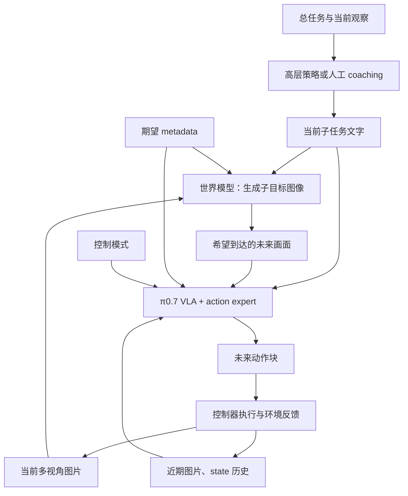

# π0.7 世界模型与 action expert：训练方法和数据有什么不同？

<!-- reading-nav-start -->
[首页](../../README.md) · [PI入口](README.md) · [按问题查找](../FIND_BY_QUESTION.md)
<!-- reading-nav-end -->

<!-- reading-toc-start -->
<details>
<summary>本页目录：按问题跳读</summary>

- [1. 先看系统怎样运行](#1-先看系统怎样运行)
- [2. 两个模型在学两个条件分布](#2-两个模型在学两个条件分布)
- [3. 为什么它们都能用 flow matching？](#3-为什么它们都能用-flow-matching)
- [4. 世界模型到底用了什么数据？](#4-世界模型到底用了什么数据)
- [5. 同一条机器人记录，如何拆成不同训练样本？](#5-同一条机器人记录如何拆成不同训练样本)
- [6. π0.7 的两种“未来图像用法”必须分开](#6-π07-的两种未来图像用法必须分开)
- [7. 四种时间，不要混起来](#7-四种时间不要混起来)
- [8. 与 π0.6* 和 MEM 的数据差异，放在一起记](#8-与-π06-和-mem-的数据差异放在一起记)
- [9. 对公开证据应保留哪些边界？](#9-对公开证据应保留哪些边界)
- [10. 自测与答案](#10-自测与答案)

</details>
<!-- reading-toc-end -->


核对日期：2026-09-19。建议先读 [flow matching 零基础讲解](../../openpi_study/07_FLOW_MATCHING_FROM_ZERO.md)。本文区分论文明确披露、上游 BAGEL 实现与教学示意，未公开的训练细节不补写。

**核心大纲：** 两个生成器的分工 → 两种 flow matching → 各自的数据标签 → 同一条轨迹如何拆样本 → π0.7 的真实训练/部署流程 → 与 MEM、RECAP 的区别。

**最关键的区别：两者都可以用 flow matching。action expert 生成连续动作；π0.7 的世界模型生成未来子目标图像。** 因此主要差别是生成对象、条件输入、目标标签和运行职责，而不是“一个用 flow matching，另一个用世界模型这种损失”。世界模型是功能名称，不是一种唯一的训练损失。

## 1. 先看系统怎样运行



例如子任务是“把杯子放进柜子”：世界模型给出杯子已经在柜内的目标画面；action expert 根据当前手臂姿态、场景和这个画面，生成如何移动、何时松夹爪的动作。

π0.7 可以在不提供子目标图像时运行。图中展示的是启用图像目标的路径，不能说每一次 π0.7 推理都必须等待世界模型。[来源：π0.7 §V-E、§VII、Algorithm 1](../papers/pi/pi07.pdf#page=7)。

## 2. 两个模型在学两个条件分布

为避免把机器人时间与去噪时间混在一起，这里用 k 表示真实轨迹时刻，用 τ 表示 flow 噪声时间。

| 项目 | 连续 action expert | π0.7 的世界模型 / 子目标生成器 |
|---|---|---|
| 问题 | 现在应该怎样动？ | 完成当前子任务时，画面可能/应该是什么样？ |
| 建模对象 | 条件动作分布 | 条件未来图像分布 |
| 主要条件 | 图片、state、指令；π0.7 还可用历史、子目标图、metadata、控制模式 | 当前多视角图、子任务；Algorithm 1 还以 metadata 为条件 |
| 干净目标 | 连续动作块 A | 子任务片段末尾的多视角图像 G，经 VAE 编为潜变量 z |
| 被加噪声的东西 | 动作数组 | 目标图像的潜变量数组 |
| 网络生成过程中的输出 | 动作空间中的向量场 | 图像潜变量空间中的向量场 |
| 最后输出 | 动作数值，需要逆变换和控制器执行 | 图像，需要解码并交给 VLA 当目标 |
| 必须有匹配的机器人动作标签吗 | 对这里的机器人动作监督是必须的 | 该图像生成目标本身不要求关节动作标签 |
| 必须知道目标时刻的真实图片吗 | 基础动作 flow loss 不需要；π0.7 的图像条件训练会额外用到 | 训练该未来图像目标需要；部署时改为模型生成 |

可以把接口概括为：

$$
\pi_\theta(A\mid O_{k-K:k},q_{k-K:k},\ell,\hat\ell,G,m,c)
$$

$$
p_\psi(G\mid O_k,\hat\ell,m).
$$

$O$ 是图片，$q$ 是本体状态，$\ell/\hat\ell$ 是总任务/子任务，$m$ 是 metadata，$c$ 是控制模式。前式展示可用条件，实际会有条件缺失与 dropout；后式依据论文运行算法。**附录 C 对世界模型样本的直接列举是子任务文字、3 张输入图和 3 张目标图，不宜据此臆造其全部 metadata 标注细则。** [来源：§VI-B/C、Algorithm 1、Appendix C](../papers/pi/pi07.pdf#page=22)。

## 3. 为什么它们都能用 flow matching？

### 3.1 动作生成：在动作数组上构造路径

按照 openpi 的时间方向，干净动作 A 与同形状噪声 ε 混合：

$$
x_\tau=(1-\tau)A+\tau\epsilon,
\qquad u_{\mathrm{action}}=\epsilon-A.
$$

模型预测 $v_\theta(x_\tau,\tau,c_{\mathrm{action}})$，用均方误差匹配目标变化率。采样时从 τ=1 的噪声向 τ=0 积分，得到动作块。详见 [带手算例子的动作教程](../../openpi_study/07_FLOW_MATCHING_FROM_ZERO.md)。

### 3.2 图像生成：在图像的压缩表示上构造路径

直接处理每个像素很贵，因此先用 **VAE** 把目标图像 G 编为潜变量 $z_0$。你可以先把 VAE 理解为“把图片变成可恢复的压缩数字，再把数字还原成图片”的编码器/解码器。

$$
z_0=\mathrm{Encode}_{\mathrm{VAE}}(G),
\qquad z_\tau=(1-\tau)z_0+\tau\epsilon_z.
$$

训练图像生成网络预测对应变化率：

$$
\mathcal L_{\mathrm{image}}
=\mathbb E\left[\left\|w_\psi(z_\tau,\tau,c_{\mathrm{image}})
-(\epsilon_z-z_0)\right\|^2\right].
$$

推理把潜变量噪声逐步变成 $\hat z_0$，再解码得到目标图 $\hat G$。两条公式形状相似，但 A 是动作，z 是图像表示，**两者的维数、语义、训练条件与解码方式都不同**。

证据边界：π0.7 Appendix C 明确其世界模型从 BAGEL 初始化、基本沿用其配方，Figure 19 展示了带噪目标的 VAE 路径。上面采用的是便于比较的 flow 形式，亦可在 [BAGEL 固定版本代码](https://github.com/ByteDance-Seed/Bagel/blob/a2fa77dd8caeefc41e6607ae0ec17408d3f4ee9f/modeling/bagel/bagel.py#L190) 中核对潜变量插值与 `noise - packed_latent_clean` 目标；它**不是完整复刻 π0.7 内部的采样时间、损失权重和全部训练配置**。

### 3.3 这里的世界模型，不等于完整物理仿真器

一些世界模型研究动作条件动力学，例如“给定状态 s 和动作 a，预测下一状态”。π0.7 披露的这个模块主要是**按观察、语义子任务及条件生成未来子目标图像**，不是把任意数值动作序列输入进去做物理仿真。

它没有因为生成了一张合理图片，就证明对应目标可达、抓取稳定或满足所有接触约束。论文也不能据此被解读为已经实现“在世界模型中搜索很多条动作，再通过模型内 RL 训练控制器”。

## 4. 世界模型到底用了什么数据？

根据 [π0.7 Appendix C](../papers/pi/pi07.pdf#page=22)：

| 数据来源 | 使用理由 | 需要注意 |
|---|---|---|
| 自有机器人数据的子集 | 提供当前场景与子任务完成时画面的对应关系 | 不是宣称把 VLA 全量数据一模一样用来训练世界模型 |
| 第一人称人类视频的子集 | 提供操作语义及视觉变化 | 不要求为图像生成目标提供机器人关节命令 |
| 高质量分段语言标签 | 明确哪个时间区间在完成哪个子任务 | 论文特别指出时间分段质量影响目标图质量 |
| 开源图像编辑数据、开源视频数据 | 帮助保留通用语义/图像变化知识 | 未披露完整数据集清单、混合比例，不能自行补全 |

机器人样本可以理解为：

```text
子任务文字：把杯子放进柜子
输入：时刻 k 的三路相机图片
目标：覆盖 k 的这段子任务，在结束时刻 k_end 的三路图片
另有可用条件：按论文算法使用 metadata；完整构造细节未全部公开
```

高质量分段标签不自动意味着每段操作都成功，也不等于所有未来图片都是完美目标。具体筛选、质量控制和条件设计仍然重要。人类视频如何与三视角机器人样本统一打包，论文没有给出足以复刻每种数据适配的细节。

**网络不是同时收到三张不同“未来答案”来任意挑选。** 机器人样本中的三张目标图对应多个相机视角。当前图像分别经 ViT（侧重语义）和 VAE（保留细节）两种路径处理；训练中的目标图经 VAE 得到带噪生成目标。不要把“三路相机”和“同一图像的不同编码路径”混为一谈。

## 5. 同一条机器人记录，如何拆成不同训练样本？

下面是**教学用假想记录**，不代表 PI 的真实数据文件格式：50 Hz 采集，当前第 600 帧，约 12 秒；“放杯子”子任务覆盖第 500–749 帧。

| 原始记录字段 | 内容 |
|---|---|
| `episode_id`、`frame_id`、`timestamp` | 回合标识与采样顺序 |
| `images[frame_id][camera]` | 同步相机图片 |
| `state[frame_id]` | 实际关节/夹爪等本体状态 |
| `action[frame_id]` | 当时发送的控制命令 |
| `task`、`subtask_segments` | 总任务与带起止时间的子任务 |
| `success`、`intervention_mask` | 任务结果与人类接管位置，如果采集了这些信息 |
| `quality/speed/mistake` 等 | 按明确规则构建的 episode/片段信息，部分可后处理生成 |

从这份记录可以整理出：

| 学什么 | 网络条件 | 训练目标 | 还需什么处理 |
|---|---|---|---|
| 基础动作 flow | 第 600 帧图片、state、指令 | `action[600:650]`，即第 600–649 步动作 | 归一化；生成噪声和 τ；自动算 flow 目标 |
| MEM 低层动作 | 例如第 350、400、450、500、550、600 帧图片和 state | 同一动作块 | 保留 1 秒间隔的历史顺序，不跨 episode |
| MEM 高层记忆 | 已有摘要、当下观察、任务 | 下一个子任务与更新摘要 | 从子任务记录、成败信息等构造摘要监督 |
| RECAP 价值/策略 | 观察、任务；策略再加优势条件 | 回报分布标签；条件化动作学习目标 | 从完整结果算回报，训练价值模型，派生优势条件 |
| 世界模型 | 第 600 帧图片、当前子任务及相应条件 | 第 749 帧的子任务结束图片 | 精确分段；VAE 编码；图像 latent 的加噪与损失 |
| π0.7 图像目标条件下的 VLA | 当前/历史观察、state、子任务、目标图等 | 仍是 `action[600:650]` | 目标图成为输入条件；它不是用来替代动作标签 |

这说明**同一份原始轨迹可以服务多个目标，但不能说这些模型需要完全相同的训练样本**。它们截取的时间范围、作为条件的字段、要预测的标签不同。

## 6. π0.7 的两种“未来图像用法”必须分开

### A. 训练世界模型：未来图像是它要学会生成的答案

Appendix C 的机器人训练目标是**当前子任务片段的末尾图像**。模型从当前画面和子任务等条件生成它。

### B. 训练 VLA：未来图像是帮助它预测动作的条件

在 [§VI-C](../papers/pi/pi07.pdf#page=7) 中，π0.7 的动作训练同时使用真实未来图与生成图。当选择真实未来图作为条件时：

- 25% 的情况取当前子任务片段的末尾图；
- 75% 的情况从当前起未来 0–4 秒均匀选图；
- 另外构造使用世界模型生成子目标的训练样本，减小真实图与生成图之间的分布差异。

**另有一个不同的 25%：** §V-E 说每个训练 batch 仅给 25% 的样本添加视觉子目标。它描述“哪些样本有图像条件”；上面的 25% 描述“选择真实图像时，哪些取片段末尾”。这两个比例的分母不同，不要写成一条统计，也不要据此推导论文未给出的完整混合比例。

训练 VLA 时，真实未来图可来自已经完整记录的轨迹。部署时没有真实未来答案，使用的是生成目标；论文加入生成图训练正是为了处理这种差异。目标图还会作为可选条件，因此 VLA 不必永远依赖它。

## 7. 四种时间，不要混起来

| 时间/长度 | 含义 | 是否同一个东西 |
|---|---|---|
| flow 时间 τ∈[0,1] | 数字生成过程里的噪声程度 | 与真实秒数无直接对应 |
| 动作块长度 | 接下来多少个机器人控制时刻 | π0.7 实验用 50 步动作块 |
| 子目标标签时刻 | 世界模型训练时要生成哪一帧 | 附录 C 是子任务片段末尾，不固定为 4 秒后 |
| 子目标刷新间隔 | 部署时多久更新一次目标图 | 子任务改变，或约 4 秒经过时触发 |

此外，π0.7 动作采样使用 5 次去噪，而世界模型运行设置是 25 次去噪；二者可以异步执行。它们的去噪次数不代表各自输出 5 步动作或 25 帧视频。上述均是论文实验设置。[来源：§VII、Appendix C/D](../papers/pi/pi07.pdf#page=7)。

## 8. 与 π0.6* 和 MEM 的数据差异，放在一起记

| 方法 | 新增的核心信息 | 它回答的问题 |
|---|---|---|
| 基础 action flow matching | 配对的观察与连续动作；噪声/流目标自动生成 | 怎样根据条件生成动作？ |
| π0.6* / RECAP | 结果、回报、纠错，再派生价值/优势 | 哪些行为值得提高概率？ |
| π0.6-MEM | 过去观察序列与过去事件的记忆监督 | 我之前经历了什么、已经做过什么？ |
| π0.7 世界模型 | 当前到子任务结束的图像对与精确语言分段 | 这个子任务完成时可能是什么画面？ |
| π0.7 的 VLA | 动作标签依然在；增加历史、图像目标、metadata 等条件 | 在这些条件和目标下怎样执行？ |

一个任务的 **reward/return（奖励/回报）**、**memory（记忆）**、**image goal（图像目标）** 不能互相替代。知道“刚才失败了”不直接给出下一段关节命令；知道“杯子应该在柜内”也不直接告诉机器人怎么绕开柜门。

## 9. 对公开证据应保留哪些边界？

1. 世界模型不是 action expert 的替代品。两者在图像目标启用时配合工作。
2. BAGEL 的开源代码是理解图像 flow 的辅助材料，不等于 PI 已公开自己的全部世界模型训练代码。
3. 论文披露的 world model 数据不要求每条都有机器人关节命令；这不证明任意无标注网络视频都能直接用于训练。
4. 没有公开完整数据规模、全部数据集配比、所有标签流水线和 π0.7 训练超参数，不能据此给出可信的完整复现预算。
5. 图像条件带来语义泛化收益的实验，要结合是否用 coaching、是否后训练、是否启用图像目标一起读。[对应原论文实验笔记](07_pi07.md)。

## 10. 自测与答案

- **把动作表换成未来图片，是否只是改一下输出维度？** 不够；还要更换表示空间、编码/解码、条件和训练数据处理。
- **世界模型用了 flow matching，是否就能直接输出关节动作？** 不能；训练目标是图像潜变量。
- **世界模型每 4 秒刷新，所以训练标签总是 4 秒后的图片？** 不是；附录中的目标是子任务片段末尾。
- **给 VLA 一张未来图，还要动作标签吗？** 训练这里的动作损失仍需要；未来图是条件，动作是答案。
- **MEM 和世界模型都涉及图像，它们是不是一回事？** 不是；前者提供过去信息，后者生成未来目标。

<!-- reading-footer-start -->
[前一篇：π0.7](07_pi07.md) · [接着读：机制与数据](../MECHANISMS.md) · [返回PI入口](README.md)
<!-- reading-footer-end -->
