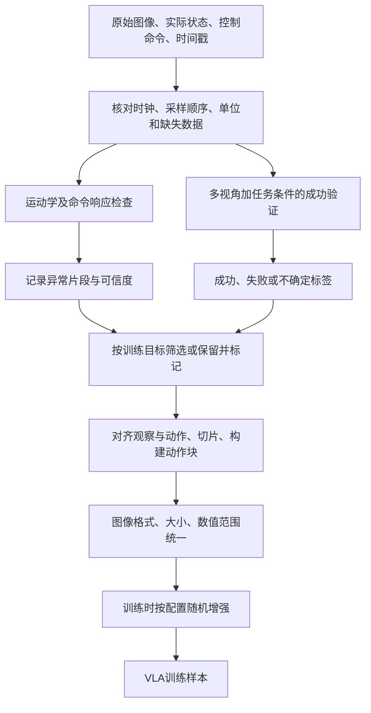

# 三项数据质量概念：运动学检查、多摄像头成功验证、视觉归一化

核对日期：2026-09-19。**核心大纲：三者各查什么 → 一条轨迹的处理流程 → 运动学与延迟 → 多视角成功判定 → openpi真实图像流程 → 访谈追问。**

先记住一句话：**运动学检查问“记录的运动是否可信”；成功验证问“目标是否真的完成”；视觉归一化问“图像是否按模型约定输入”。** 三者都服务训练数据质量，但不能互相替代。

## 1. 哪些能确认，哪些不能归到 PI 名下？

这三个术语来自学习问题。本文解释其技术逻辑，不把未经公开验证的访谈表述写成公司事实。

| 内容 | 公开证据能支持到哪里 | 不能据此声称什么 |
|---|---|---|
| Kinematics sanity check | 机器人状态、时间戳、关节约束有公开接口定义；可以据此设计轨迹合理性检查 | 未找到PI公开、可复刻的完整检查器、阈值及剔除率；不能声称本文示例就是PI内部算法 |
| 多摄像头验证成功 | Gemini Robotics 1.5论文明确演示、评测多视角success detection，可作为原理例子 | 这不是PI使用同一成功分类器的证据；多摄像头输入也不自动意味着有成功验证模块 |
| 视觉归一化 | 固定版本openpi能直接查到resize/pad、像素值转换、训练增强 | 该公开路径不等于PI全部生产数据清洗SOP，也不能代表π0.7/世界模型的全部预处理 |

全文用三个标记：**[公开实现/论文]**、**[教学工程示例]**、**[待专家确认]**。后两者不补写成官方事实。

## 2. 先把一条机器人记录看清楚

假想任务：“把红杯子放进柜子，松开夹爪并关好柜门”。一条episode（从开始到结束的一次尝试）可能记录：

| 字段 | 例子 | 给谁使用 |
|---|---|---|
| 各传感器采集时间戳 | `t_camera_base`、`t_camera_wrist`、`t_joint` | 对齐多模态记录 |
| 多路图像 | 外部相机、左/右腕部相机 | 感知、动作学习、成功验证 |
| 实际状态 `q(t)` | 实际关节角/夹爪开度 | 运动学检查、动作网络条件 |
| 命令 `a(t)` | 发给控制器的目标关节角、速度或末端位姿 | 动作监督；**不是实际已到达的状态** |
| 任务与分段 | 总目标、抓杯子/放杯子/关门的起止时间 | 条件输入、阶段监督 |
| 结果与质量标记 | 成/败/不确定、接管、掉帧、可疑速度段 | 筛选或带条件学习 |

**[教学工程示例]** 下图展示一种合理组织方式，不声称这是PI内部流水线。



两个容易忽略的点：**失败轨迹也可能是真实、有价值的数据**，如π0.7可结合质量/错误metadata学习；不能默认“只留成功”。**丢弃一个坏点后不能把相隔很久的两端假装成相邻控制步**；切片、重采样、mask规则要保留真实时间关系。[π0.7混合质量数据与上下文](07_pi07.md)

## 3. Kinematics sanity check：检查运动记录是否说得通

### 3.1 Kinematics 是什么？

运动学描述位置、姿态、速度等几何运动关系。例如机器人关节角为 `q`，通过连杆结构计算末端位置/姿态，叫**正运动学**。它不等于动力学：仅有关节角和速度，不能证明电机扭矩、接触力、稳定性都满足要求。

**[公开接口]** ROS的JointState用关节名对应位置、速度和力/力矩，并要求同一消息内状态来自同一时刻；转动关节位置通常用rad，速度用rad/s。关节上下限、速度上限等可由机器人描述/配置提供。[ROS消息定义](https://github.com/ros2/common_interfaces/blob/rolling/sensor_msgs/msg/JointState.msg) · [ros2_control约束字段](https://control.ros.org/master/doc/api/structjoint__limits_1_1JointLimits.html)

### 3.2 实际可以查什么？

**[教学工程示例]** 必须先知道本体、关节顺序、单位和控制模式，才能选检查项。

| 检查 | 做法 | 异常不一定是什么 |
|---|---|---|
| 时间/字段 | 时间是否递增、是否有重复/缺失；每列对应哪个关节；是否混了度和弧度 | 重复时间戳可能来自记录器，不是机器人真停止 |
| 位置范围 | 有限转动/移动关节是否越硬件或任务约束 | 连续转动关节不能随意套固定角度上下限 |
| 速度/加速度 | 用实际采样间隔差分，或与驱动器报告值交叉检查 | 高速度可能是真动作、单位错误或掉帧；不能直接断言数据坏 |
| 几何一致性 | 从关节角算末端位姿，与记录/视觉估计对比 | 坐标系或标定错也会造成不一致 |
| 命令—响应 | 比较发出的控制目标与后续实际状态 | 跟踪差可能来自机械负载/接触，未必是网络延迟 |

额外的碰撞、力矩、平衡检查需要环境几何、动力学或传感器信息，不是只看一张关节角表就能全部完成。

### 3.3 用三个数算一次“速度尖峰”

一维关节的有限差分近似：

$$
\hat v_i=\frac{q_i-q_{i-1}}{t_i-t_{i-1}}.
$$

**[教学假数据]** 三次采样为：

| 时间（秒） | 实际角度（rad） | 与上一点的差分速度 |
|---|---:|---:|
| 0.00 | 0.10 | — |
| 0.02 | 0.12 | 1 rad/s |
| 0.04 | 1.12 | 50 rad/s |

如果**这台假想机器人的有效速度上限**是2 rad/s，第三点就应被标记复核。2 rad/s只是例子，不是PI阈值或所有机器人的通用值。下一步查看原始时间戳、驱动状态、视频和后续点，区分真实超限、传感器跳点、关节列错位、丢帧或单位错误，再决定重处理、切除片段或丢弃episode。

加速度可由速度再差分估计，但求导会放大噪声；非均匀采样还要对齐速度所在时刻。转动角跨过±π时，直接相减可能误报，须按该关节的角度表示正确展开/计算角差。**“先滤波再检查”可能掩盖原始跳变，不能把平滑后的好看曲线当作原记录可信的证明。**

### 3.4 为什么不能说“运动学检查消除了 teleop lag”？

遥操作延迟是**命令产生、网络传输、控制器接收、机械响应、相机成像与日志记录**之间的时间问题。关节速度尖峰是运动序列的异常形态，二者可能相关，但不是同一个指标。

例如图像实际拍在 `t=1.00s`，却配上 `t=1.20s`的动作；关节运动完全平滑，训练样本仍可能错配。反过来，命令发送到关节运动有一定延迟，也可能是正常的控制/机械响应。

**[教学工程示例]** 记录采集、发送、接收与执行时间；验证时钟偏移/漂移；在可重复动作上估计响应延迟，并结合控制模式判断。观察与未来动作的配对规则必须符合模型预测目标，不能为了让曲线重合就任意平移标签。只有验证了稳定偏移来源，才能考虑校正；不稳定的延迟/抖动要另标记或剔除受影响片段。

ROS `ApproximateTimeSynchronizer`按消息时间戳配对；这只是软件配对，**不等于相机硬件同时曝光，也不能自动修正错误时间戳**。[官方message_filters说明](https://github.com/ros2/message_filters/blob/rolling/doc/index.rst)

**更准确的理解：** 运动学检查发现不可信运动；时间同步与延迟分析解决多模态时序；它们配合提高数据质量，而非一个速度阈值自动解决全部遥操作滞后。

## 4. 多摄像头状态变化验证成功：从“变化”到“目标成立”

### 4.1 先写成功条件，再看相机

对放杯子任务，画面变化可能来自机器人手臂移动、曝光变化或人走过。**变化是证据之一；成功由任务语义和评价标准决定。**

**[教学工程示例]** 把目标拆成：

```text
杯子是指定的红杯子
AND 杯子已经放到柜内目标位置
AND 夹爪已经释放杯子
AND 柜门已经关好
```

如果任务只要求“把杯子放进柜子”，就不能额外强制“关门”才能成功；判据必须与指令一致。如果杯子暂时被手遮住，应输出“不确定”，而非“杯子从画面消失，所以已放好”。

### 4.2 为什么要多视角？

| 视角 | 容易看到 | 可能看不到 |
|---|---|---|
| 外部/头部相机 | 杯子与柜子的相对位置、门的状态 | 手挡住的杯子、柜内深处 |
| 腕部相机 | 是否抓对对象、是否松开、局部放置 | 整体目标位置或门是否完全关闭 |
| 另一侧相机 | 遮挡后的接触/落点 | 不保证永远有无遮挡证据 |

证据可以来自不同时间：先看到红杯子被放进柜内并释放，再看到柜门关闭。门关闭后杯子看不见，不应简单把所有条件都设成“最终同一帧可见”。这就需要时序理解、目标跟踪或带记忆的判定。

**[公开论文]** Gemini Robotics 1.5的Figure 12（PDF第14页）给出把橙色饼干包从篮子放到蓝碗旁架子的例子：单路相机不能提供全部信息，多视角一起判断。§4.2/Figure 13还区分在线与离线、单视角与多视角的**判定准确率**。这是“分类器判断成败有多准”，不是“机器人完成任务的成功率”。[论文第14–15页](../papers/deepmind/gemini_robotics_15.pdf#page=14)

### 4.3 可以怎样实现？

以下是**通用设计选项**，不是已确认的PI方案：

| 路径 | 输入 → 处理 → 输出 | 适用边界 |
|---|---|---|
| 检测/跟踪 + 几何规则 | 多视角物体位置/姿态 → 目标区域、接触或释放规则 → 成/败/不确定 | 规则清楚、场景较稳定；要处理遮挡/标定误差 |
| VLM/视频成功分类器 | 指令 + 同步多视角或一段视频 → 语义/时序推理 → 成败与证据 | 灵活但可能误判；应有独立人工标签验证 |
| 多信号组合 | 图像证据 + 夹爪/重量/开关等传感器 → 一致性判断 | 取决于硬件；单个夹爪开度也不保证物体已正确放置 |

若要把三维点在不同相机间对应起来，需要相机内参、外参和畸变模型；这是**几何标定**，不是把像素缩放到[-1,1]。如果采用端到端多视角VLM，不一定显式三角化，但仍需正确的视角标识和时间对应。[OpenCV相机标定与投影](https://docs.opencv.org/4.13.0/d9/d0c/group__calib3d.html)

### 4.4 如何知道这个“验证器”可靠？

**[教学工程示例]** 使用独立人工标注成败的轨迹，分别统计：

- **假成功**：实际失败却被判成功，会把坏标签送入训练/评估。
- **漏成功**：实际成功却被判失败，会丢掉好数据或导致机器人反复操作。
- **不确定率**：遮挡或证据不足时交给人工复核，而非强行二选一。
- **时延**：在线判定会不会晚到；离线清洗可多看后续帧，在线不能偷看未来。

多台相机可能一起被遮挡或产生相关错误，不能默认多数投票就可靠。任务完成状态可以要求在短窗口内稳定，但窗口长度要按任务验证，不能统一设为固定帧数。

## 5. 视觉归一化：沿 openpi 的真实代码看一遍

本节使用已收录上游commit **`215abfb217dbac7d5f1273282331b9b1866c0479`** 的**JAX主线、π0/π0.5配置**。PyTorch有独立预处理入口，不能把这里的每个数组布局直接套过去。论文原版训练与开源checkpoint亦需区分。

### 5.1 先分清四件事

| 名称 | 改什么 | 是否主要在训练时随机做 |
|---|---|---|
| 格式统一 | RGB通道含义、相机键、HWC/CHW、dtype | 否；训练/推理都必须匹配 |
| 空间尺寸统一 | 保持比例resize，补边到模型尺寸 | 通常是确定性处理 |
| 像素数值归一化 | 0–255映射到模型预期范围 | 否；训练/推理都要一致 |
| Photometric jitter | 随机改亮度、对比度、饱和度 | 是，属于数据增强 |

**归一化是统一接口/尺度；增强是有意制造变化来训练鲁棒性。** 颜色抖动不是把所有光照“校准成同一种”，也不是相机几何标定或消除遮挡。

### 5.2 代码顺序与具体例子

**第1步：把数据映射到正确的相机与格式。** 例如ALOHA adapter将原相机键映射到`base_0_rgb`、`left_wrist_0_rgb`等；缺失视角按对应adapter设占位图及mask。LIBERO adapter可把LeRobot读出的float/CHW图像转换到uint8/HWC。这是数据集适配，不代表任意float输入都能自动正确识别。[ALOHA适配](https://github.com/Physical-Intelligence/openpi/blob/215abfb217dbac7d5f1273282331b9b1866c0479/src/openpi/policies/aloha_policy.py) · [LIBERO适配](https://github.com/Physical-Intelligence/openpi/blob/215abfb217dbac7d5f1273282331b9b1866c0479/src/openpi/policies/libero_policy.py#L19)

读取的是RGB还是BGR必须在采集/适配端确认；名字带`rgb`不会自动替你交换错误通道。

**第2步：保持比例缩放并补边。** π0/π0.5的`ModelTransformFactory`配置`ResizeImages(224,224)`，调用`resize_with_pad`。例如640×480（宽×高）图片变成224×168，再上下各补28像素，得到224×224。它不会直接把长方形拉成正方形。[配置](https://github.com/Physical-Intelligence/openpi/blob/215abfb217dbac7d5f1273282331b9b1866c0479/src/openpi/training/config.py#L113) · [缩放/补边实现](https://github.com/Physical-Intelligence/openpi/blob/215abfb217dbac7d5f1273282331b9b1866c0479/src/openpi/shared/image_tools.py#L13)

uint8黑边是0；已归一化float图的黑边是-1。此函数接受的float范围也有约定，不能把0–255浮点数原样传入。[同一实现](https://github.com/Physical-Intelligence/openpi/blob/215abfb217dbac7d5f1273282331b9b1866c0479/src/openpi/shared/image_tools.py#L13)

**第3步：转成模型要求的float范围。** `Observation.from_dict`对uint8图像执行：

$$
x_{\rm model}=2\frac{x_{\rm uint8}}{255}-1.
$$

因此0→-1，255→1，128→约0.00392。**这条路径不是“每张图减去自己的平均亮度”，也不是按训练集逐通道mean/std标准化。** 对已经是float的数据，该函数不会按uint8分支再换算，所以adapter必须保证正确范围，避免漏做或重复做。[实际代码](https://github.com/Physical-Intelligence/openpi/blob/215abfb217dbac7d5f1273282331b9b1866c0479/src/openpi/models/model.py#L111)

**第4步：仅训练时随机增强。** `preprocess_observation(train=True)`将[-1,1]临时换成[0,1]，交给augmax：

- 相机键不含`wrist`：约95%裁剪、resize回原尺寸、`Rotate((-5,5))`。
- 所有视角：`ColorJitter(brightness=0.3, contrast=0.4, saturation=0.5)`。
- 增强后换回[-1,1]；`train=False`不运行这段随机增强。

这些是该commit调用库的参数，**不是每张图固定变亮30%**。模型预处理还会在尺寸不符合时再次调用resize，因此要沿实际数据入口理解处理链，而不是机械重复执行两次缩放。[训练增强完整分支](https://github.com/Physical-Intelligence/openpi/blob/215abfb217dbac7d5f1273282331b9b1866c0479/src/openpi/models/model.py#L144)

**第5步：把图像、mask、state与文字一同送入模型。** 这时图像处理完，不代表state/action也处理完；后者有自己的变换与统计量。

### 5.3 为什么 state/action normalization 是另一回事？

openpi的`Normalize`按配置和统计量执行z-score或分位数缩放。对动作/状态可用训练数据的1%/99%分位数把主要范围映射到[-1,1]附近；超出分位数的值仍可能超过该区间，公式本身不保证裁剪。[Normalize实现](https://github.com/Physical-Intelligence/openpi/blob/215abfb217dbac7d5f1273282331b9b1866c0479/src/openpi/transforms.py#L115)

两者即使都出现[-1,1]，原因也不同：图像按像素编码范围换算，动作按物理数据分布缩放。`norm_stats.json`里的动作/状态统计不应误当作自动白平衡或全部图像校正参数。动作输出还要逆变换回控制器需要的单位。[数据到动作的完整主线](../../openpi_study/05_TRAINING_AND_DEPLOYMENT.md)

### 5.4 自己检查时看什么？

**[教学工程示例]** 取同一个样本逐步看：原图/相机名 → adapter后的dtype/shape/范围 → resize后的图 → 归一化后的min/max → 训练增强图。确认物体颜色、左右视角与指令仍对应；推理时重复送同一图，不应因为训练随机增强而不停改变输入。

如果任务依赖颜色识别，过强颜色增强可能改变任务语义；如果另带像素坐标/框标签，几何增强后也要检查标签是否相应变换。这是增强设计需要验证的条件，不能认为“增强越多越好”。

## 6. 三个概念的联系与区别

| 同一条假想轨迹 | 运动学检查 | 多视角成功验证 | 视觉归一化 |
|---|---|---|---|
| 图像偏暗但杯子确实放好了 | 运动可以完全正常 | 可能成功或因看不清而不确定 | 按模型接口处理；增强不自动修复看不见的证据 |
| 关节日志跳变，但视频动作平滑 | 标记日志/时间戳异常 | 任务可能仍成功 | 无法修复错误关节数据 |
| 运动合理，杯子放到了错误柜子 | 可以通过 | 按指令判失败 | 仍能生成格式合法的输入 |
| 三路相机不同步 | 先复核时序；不宜直接比较各路状态 | 可能把不同时间的状态误拼为“成功” | resize和像素映射不能修复时序 |

## 7. 访谈时把问题问到可验证的程度

| 主题 | 建议追问 | 希望拿到的证据 |
|---|---|---|
| 运动学检查 | 查实际state还是控制action？哪些关节/末端指标？阈值来自硬件、统计还是任务规则？如何处理角度环绕和丢帧？ | 脱敏的通过/不通过样例、规则定义、按原因统计的异常率 |
| 遥操作滞后 | lag具体指哪两个时刻？怎么测？固定偏移怎么校正、抖动怎么处理？ | 多时钟/时间戳示意、延迟分布、校正前后验证 |
| 多摄像头成功验证 | 几何规则、VLM还是专门分类器？是否看视频历史？遮挡和视角冲突怎么处理？ | 任务判据、人工标注集、假成功/漏成功/不确定率 |
| 视觉归一化 | 分辨率、RGB约定、dtype/range、补边、去畸变各在哪里做？随机增强参数？训练和推理有哪些差别？ | 一条样本处理前后图及数值；对应checkpoint配置 |
| 数据保留策略 | 检查失败就丢整条，还是切片/mask/打质量标签？失败任务轨迹是否另有用途？ | 各处理阶段保留率与标签用途，避免重复计算过滤比例 |

## 8. 小自测

1. **速度没有尖峰，是否就能保证图像动作配对正确？** 不能；可能整体错位或有稳定延迟。
2. **两台相机都发生变化，是否就代表成功？** 不能；要证明任务判据成立，并处理时序/遮挡。
3. **图像resize到224×224，是否已经完成所有归一化？** 没有；还要核对格式、范围、视角及具体模型约定。
4. **颜色抖动是不是把所有图片变成一样的光照？** 不是；它有意增加训练变化。
5. **成功验证器准确率80%，是否机器人成功率80%？** 不是；前者评判定，后者评任务执行。

[八模型对照表](../MODEL_COMPARISON_8.md) · [openpi初学者阅读顺序](../../openpi_study/02_START_HERE.md) · [调研总入口](../README.md)
